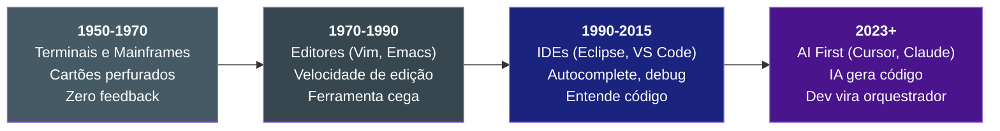
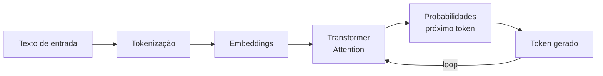
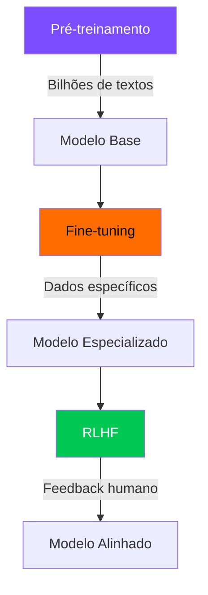
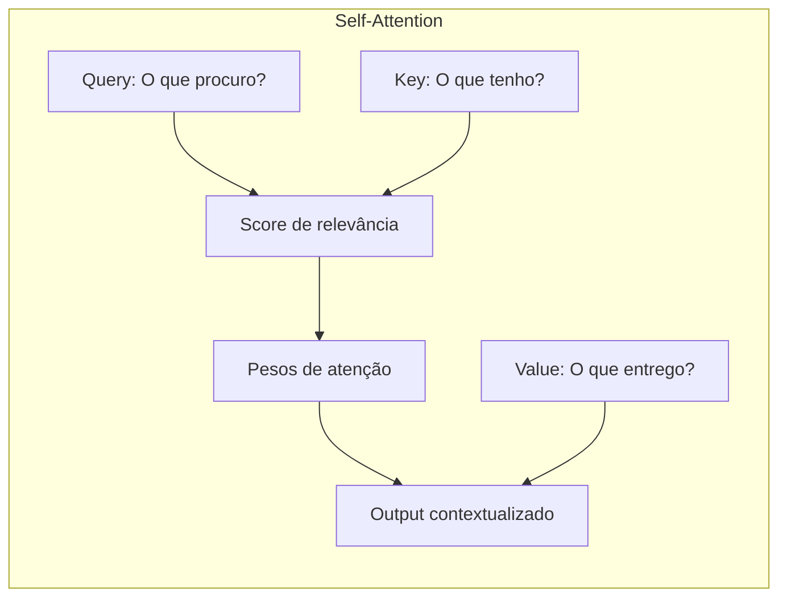
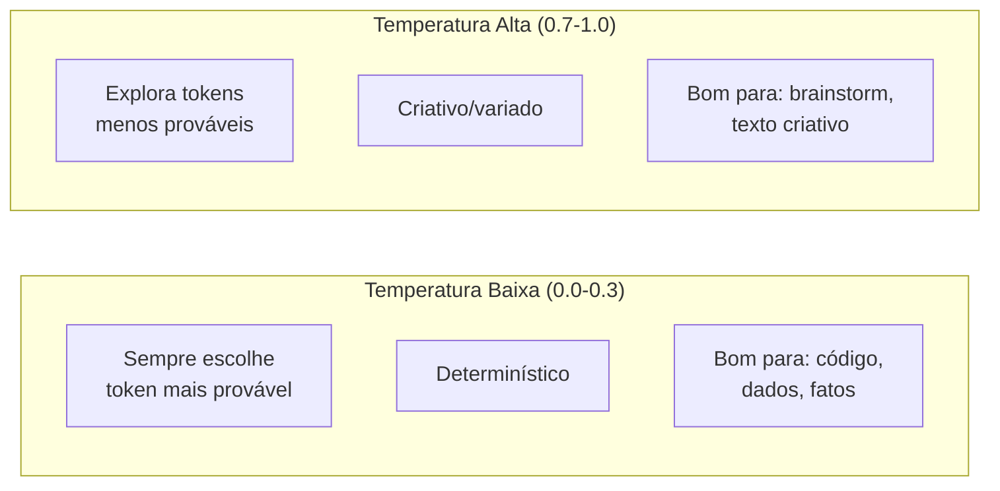
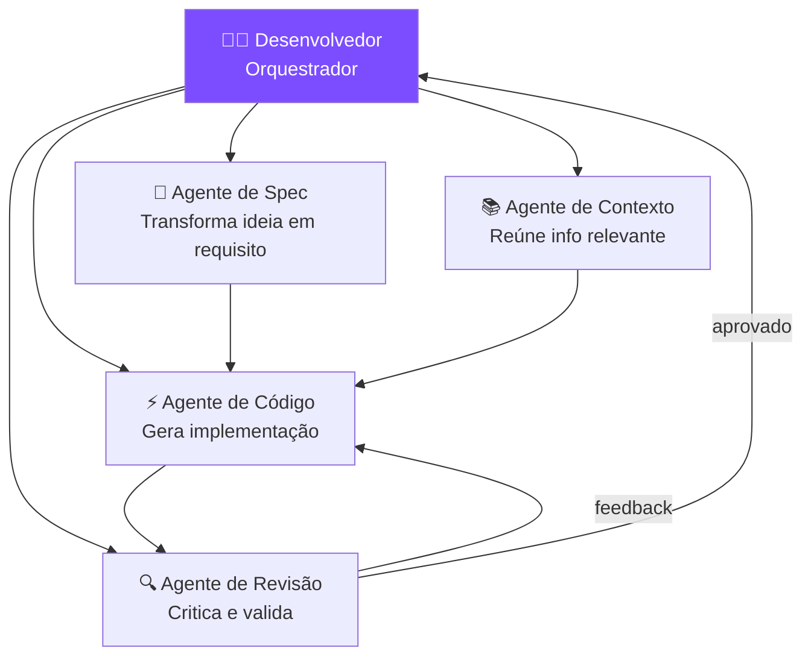

# S01 — Fundamentos de IA para Desenvolvedores

## A Evolução do Papel do Desenvolvedor

!!! tip "Insight principal"
    O dev não será substituído pela IA. Será substituído por um dev que usa IA com método.

---

## Como Funciona uma LLM

Uma **Large Language Model** é uma rede neural treinada para prever o próximo token (pedaço de palavra) com base no contexto anterior.

!!! example "Visualize embeddings em 3D"
    Palavras com significado similar ficam próximas no espaço vetorial. É assim que a IA "entende" linguagem.
    
    
    
    :octicons-link-external-16: [TensorFlow Embedding Projector](https://projector.tensorflow.org/) — explore você mesmo em tempo real

### Fases do Treinamento

| Fase | O que faz | Resultado |
|------|-----------|-----------|
| **Pré-treinamento** | Lê bilhões de textos da internet | Modelo sabe "linguagem" |
| **Fine-tuning** | Treina em dados específicos | Modelo sabe "tarefa" |
| **RLHF** | Humanos avaliam respostas | Modelo sabe "se comportar" |

---

## Tokens: O que a IA Realmente Lê

!!! warning "Conceito-chave"
    A IA não lê palavras — lê **tokens**. Uma palavra pode ser 1 ou mais tokens.
    
    - `"desenvolvimento"` → 3 tokens
    - `"IA"` → 1 token
    - `"function"` → 1 token (comum em código)

---

## Transformers e Atenção

O mecanismo de **self-attention** permite que o modelo "olhe" para todas as partes do texto simultaneamente, decidindo quais são relevantes para cada posição.

!!! info "Por que funciona bem com código?"
    Código tem **estrutura** — funções chamam funções, variáveis são declaradas e usadas depois. O attention captura essas dependências de longa distância perfeitamente.

---

## Janela de Contexto

A **janela de contexto** é a "memória de trabalho" da IA — tudo que ela consegue considerar de uma vez.

| Modelo | Janela | Equivalente |
|--------|--------|-------------|
| GPT-3.5 | 4K tokens | ~3 páginas |
| GPT-4 | 128K tokens | ~100 páginas |
| Claude 3.5 | 200K tokens | ~150 páginas |

!!! danger "Limitação crítica"
    Fora da janela = não existe para o modelo. Não há "memória" entre conversas (a menos que seja implementada externamente).

---

## Temperatura

Controla o quão "criativo" vs "previsível" é o output:

---

## O Dev como Orquestrador

!!! tip "Modelo mental"
    1. Você define objetivo, contexto e restrições
    2. A IA gera uma primeira versão
    3. Você revisa decisões arquiteturais
    4. A IA refina e ajusta
    5. Você valida com testes e métricas

---

## Determinístico vs. Probabilístico

| | Software Tradicional | Software com IA |
|---|---|---|
| **Natureza** | Determinístico | Probabilístico |
| **Mesma entrada** | Sempre mesma saída | Pode variar |
| **Erro** | Bug (defeito) | Margem esperada |
| **Qualidade** | Exatidão | Confiabilidade |
| **Teste** | Passou = correto | Passou = provável |

!!! warning "Mudança de paradigma"
    Sistema confiável ≠ sistema que nunca erra. É um sistema que **erra pouco**, **erra previsivelmente** e **falha de forma controlada**.

---

## PraticAI — Exercícios Sugeridos

1. **Tokenização**: Vá ao [Tokenizer da OpenAI](https://platform.openai.com/tokenizer) e compare quantos tokens geram textos em português vs inglês
2. **Temperatura**: Use a mesma prompt com temperatura 0 e 1 — compare os resultados
3. **Janela de contexto**: Tente fazer a IA "esquecer" algo enviando muito texto antes de perguntar sobre o início

---

## Exercício Rápido

Pegue uma classe ou método do seu projeto e peça para a IA:

1. Resumir a responsabilidade em 1 frase
2. Listar 3 riscos potenciais
3. Propor 2 testes unitários
4. Apontar o que ela **não conseguiu inferir** sem mais contexto

!!! tip "Impacto para devs"
    Entender tokens ajuda a escrever prompts menores, reduzir custo e evitar estouro de contexto. Entender temperatura ajuda a escolher entre respostas consistentes (pipelines) e criativas (brainstorm).
