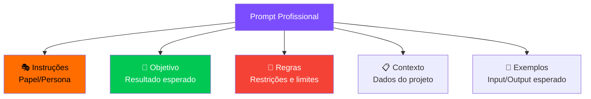
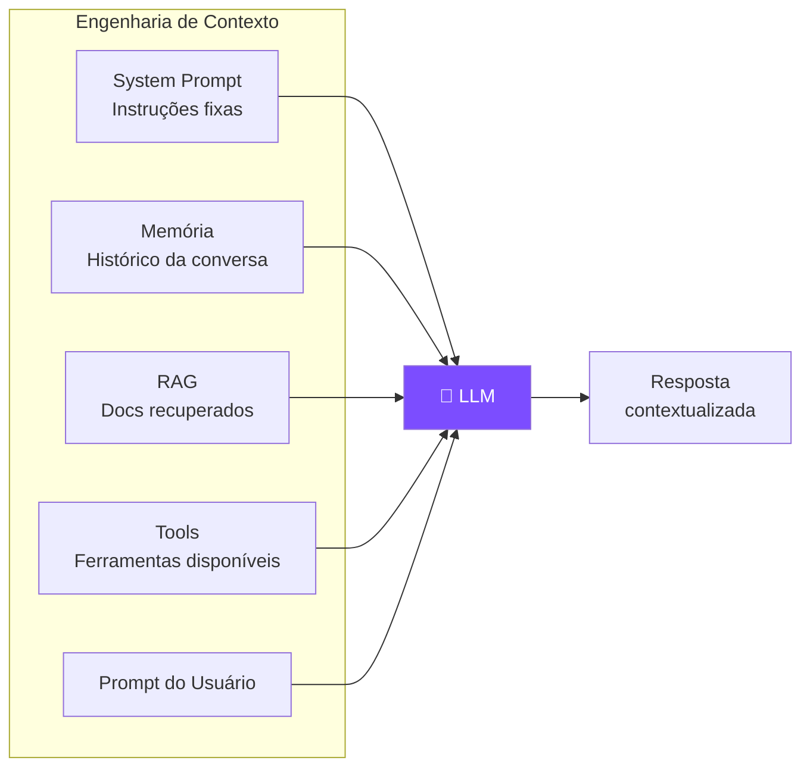
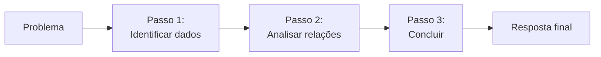

# S02 — Prompt Engineering

## Estrutura de um Prompt Profissional

Um prompt eficaz não é uma "pergunta" — é uma **especificação técnica** para a IA.



---

## Os 3 Pilares

### 🎭 Instruções (Papel)

Define **quem** a IA deve ser. Controla linguagem, profundidade e prioridade.

!!! example "Exemplo"
    *"Você é um engenheiro de software sênior, especialista em autenticação e APIs REST."*

!!! warning "Sem papel definido"
    A IA assume um "assistente genérico de internet" → respostas superficiais e pouco práticas.

---

### 🎯 Objetivo (Resultado Esperado)

Define **o que** você quer receber. Não é o caminho — é a **entrega**.

!!! example "Exemplo"
    *"Gere uma função de login em Node.js que retorne um JSON padronizado."*

Elementos de um bom objetivo:

- **O que** será entregue (função de login)
- **Em qual ambiente** (Node.js)
- **Em qual formato** (JSON padronizado)

!!! tip "Dica de ouro"
    Quanto mais claro o formato da saída, menos a IA inventa estrutura.

---

### 🚫 Regras (Restrições)

Define o que a IA **NÃO pode fazer**. É o elemento mais subestimado.

!!! example "Exemplo"
    - Não usar bibliotecas externas além de express
    - Não inventar banco de dados
    - Retornar sempre o mesmo formato JSON
    - Incluir validação de entrada

!!! danger "Regra de ouro"
    **Se você não proíbe, a IA assume. Se você não restringe, ela inventa. Se você não valida, vai para produção.**

---

## Engenharia de Contexto

O prompt sozinho não basta quando o problema depende do **seu projeto específico**.



!!! info "O que fornecer como contexto"
    - Trechos de código relevantes
    - Contratos de API
    - Exemplos de payload
    - Regras de negócio
    - README e ADRs
    - Estrutura de pastas
    - Padrões de logs e erros

---

## Padrões Clássicos de Prompting

### Chain of Thought (CoT)

Força a IA a **mostrar o raciocínio** antes da resposta final.

```
"Pense passo a passo antes de responder."
```



!!! tip "Quando usar"
    Problemas de lógica, debugging, decisões arquiteturais, análise de trade-offs.

---

### ReAct (Reason + Act)

O modelo **raciocina** sobre o que fazer, **age** (chama uma ferramenta), **observa** o resultado e repete.


!!! tip "Quando usar"
    Tarefas que exigem buscar informação, executar código, consultar APIs.

---

### Few-Shot Prompting

Fornece **exemplos** de input/output para a IA seguir o padrão.

```markdown
Converta para snake_case:
- "getUserName" → "get_user_name"
- "setOrderStatus" → "set_order_status"  
- "calculateTotalPrice" → ?
```

!!! tip "Quando usar"
    Transformações de formato, classificação, padronização de output.

---

## Prompt Completo — Exemplo Real

```text
Você é um engenheiro de software sênior especialista em 
autenticação e APIs REST.

Objetivo: Gere um endpoint de login em Node.js (Express) 
que receba e-mail e senha e retorne um JSON padronizado.

Regras:
1. Não use bibliotecas externas além de express
2. Não invente banco de dados — simule com objeto em memória
3. Retorne sempre o mesmo formato JSON (sucesso e erro)
4. Inclua validação de entrada e mensagens de erro claras

Saída esperada: Código completo + explicação curta das decisões.
```

!!! success "Por que funciona"
    - ✅ Fixa linguagem, stack e nível técnico
    - ✅ Define formato da saída
    - ✅ Impede invenção de infraestrutura
    - ✅ Exige consistência entre sucesso e erro
    - ✅ Pede explicação curta (evita verbosidade)

---

## Anti-Padrões

| ❌ Não faça | ✅ Faça |
|---|---|
| "Faz um login" | "Gere endpoint de login em Node.js/Express com JSON padronizado" |
| "Melhora esse código" | "Refatore para reduzir complexidade ciclomática, mantendo a API pública" |
| "Me ajuda com um bug" | "Este código retorna null na linha 42 quando X. Explique a causa raiz." |
| Prompt sem restrições | Listar explicitamente o que NÃO pode ser feito |
