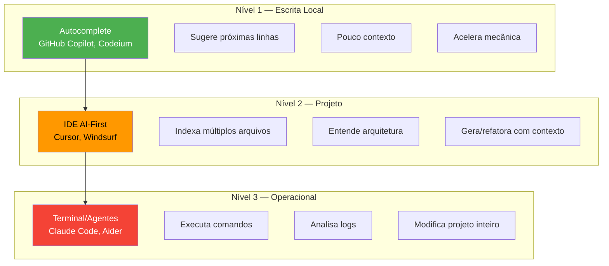
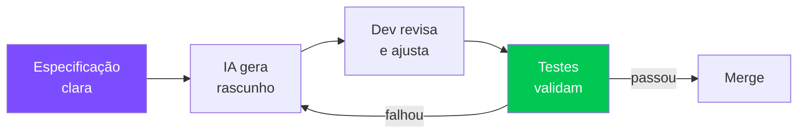
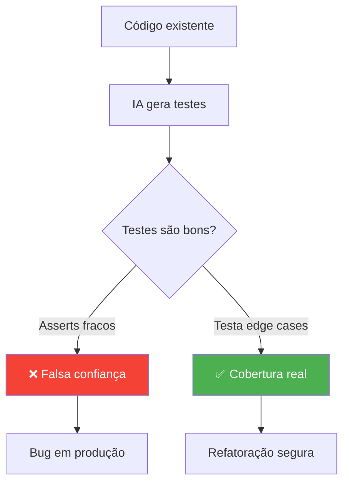
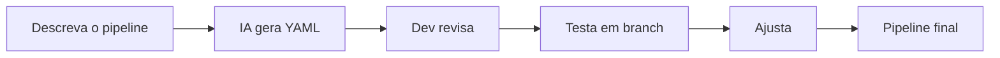
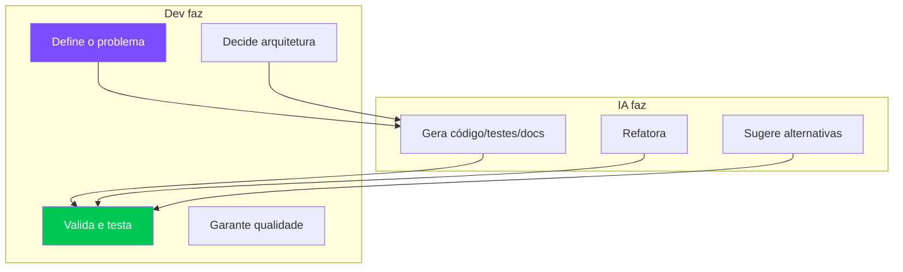

# S03 — IA no Desenvolvimento

## Ferramentas de IA: Categorias

Nem toda "ferramenta de IA" é igual. Elas operam em níveis diferentes:

!!! warning "Mais contexto = mais poder + mais risco"
    Ferramentas com pouco contexto são previsíveis mas limitadas. Ferramentas com muito contexto são poderosas mas ampliam a superfície de risco.

---

## Cursor AI — Modos de Interação

| Modo | Função | Quando usar |
|------|--------|-------------|
| **Ask** | Entender antes de alterar | Explorar código desconhecido |
| **Plan** | Raciocinar antes de executar | Mudanças complexas, refatorações |
| **Agent** | Execução assistida | Implementar features completas |

---

## Geração de Código com IA

### O Fluxo Correto

!!! danger "Código gerado = rascunho técnico"
    Nunca trate output da IA como código final. É um **primeiro draft** que precisa de revisão, teste e validação.

### Princípios

1. **Especificação antes do código** — descreva o que quer antes de pedir implementação
2. **Geração incremental** — peça em partes pequenas, valide cada uma
3. **Controle de diffs** — revise cada mudança como faria em um PR
4. **Auditoria** — verifique segurança, performance e edge cases

---

## Testes com IA

### O que a IA faz bem em testes

- ✅ Gerar boilerplate de test cases
- ✅ Sugerir edge cases que você não pensou
- ✅ Criar mocks e fixtures
- ✅ Converter testes entre frameworks

### Onde a IA falha

- ❌ **Asserts fracos** — testa que "não dá erro" em vez de validar comportamento
- ❌ **Happy path only** — ignora inputs inválidos e edge cases
- ❌ **Falsa cobertura** — 100% de linhas, 0% de confiança

!!! tip "Regra de ouro"
    Testes robustos **tentam quebrar** o código. Se a IA só gera testes que passam, ela não está testando — está confirmando.

---

## Documentação com IA

### Tipos que a IA gera bem

| Tipo | Exemplo | Dica |
|------|---------|------|
| **README** | Porta de entrada do projeto | Peça estrutura + tom técnico |
| **API Docs** | OpenAPI/Swagger | Forneça os endpoints como contexto |
| **ADRs** | Decisões arquiteturais | Descreva o trade-off, IA estrutura |
| **Diagramas** | Mermaid, PlantUML | Descreva o fluxo em texto |

!!! info "Documentação para humanos E para IAs"
    Documentação bem estruturada (README, ADRs, contratos) serve como **contexto** para a própria IA em interações futuras.

---

## CI/CD com IA

### O que funciona

- Gerar Dockerfiles a partir de requisitos
- Criar pipelines GitHub Actions/GitLab CI
- Debug de falhas em pipelines (colar log + pedir diagnóstico)

!!! danger "Pipeline é código"
    Mesmas regras de revisão, versionamento e teste se aplicam. IA gera o rascunho, você valida.

---

## Resumo: O Papel do Dev no Loop

!!! quote "Princípio fundamental"
    **Autocomplete acelera escrita, não entendimento.** Quando o gargalo é clareza de problema, modelagem ou decisão, a IA pouco ajuda — e pode até atrapalhar, criando ilusão de progresso.
