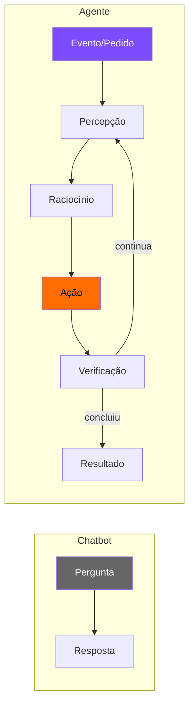
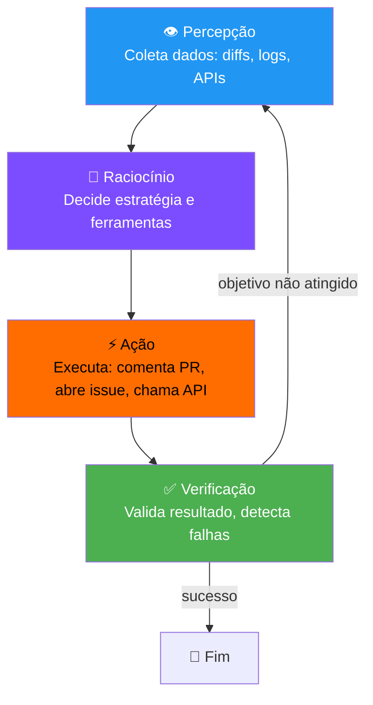
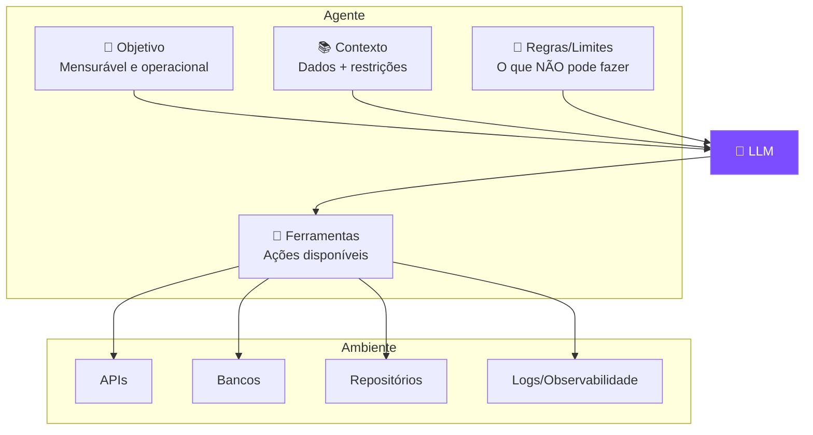
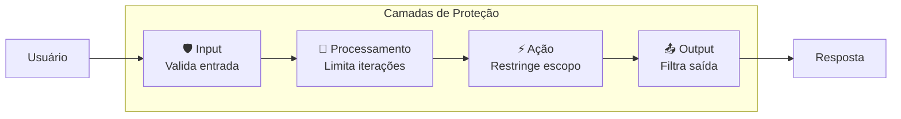
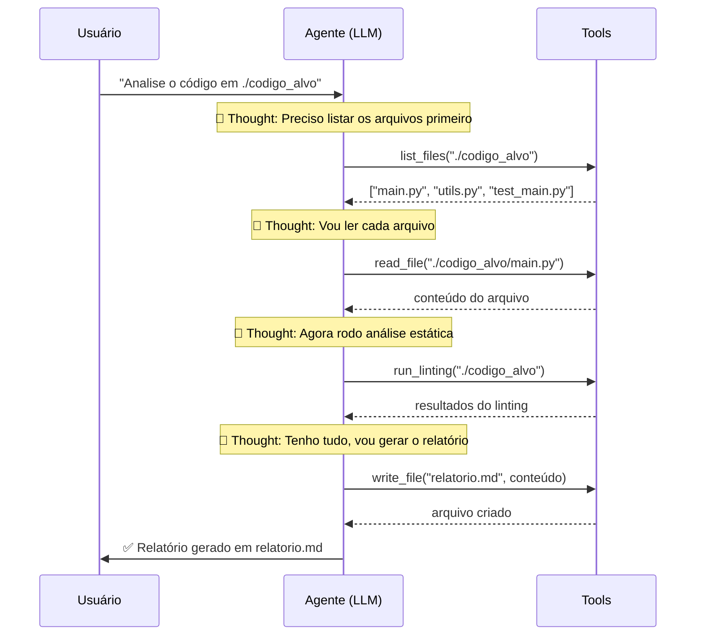

# S01 — Tools, Guardrails e Padrão ReAct

## O que é um Agente de IA?

Um agente **não é** um prompt mais longo nem uma IA mais inteligente. Um agente é uma **arquitetura**.



| | Chatbot | Automação | Agente |
|---|---|---|---|
| **Gera texto** | ✅ | ❌ | ✅ |
| **Executa ações** | ❌ | ✅ | ✅ |
| **Decide caminho** | ❌ | ❌ | ✅ |
| **Usa ferramentas** | ❌ | ✅ (fixas) | ✅ (dinâmicas) |

---

## Ciclo de Funcionamento



!!! warning "Verificação é o que separa protótipo de produção"
    Sem verificação, o agente acumula erros silenciosamente.

---

## Componentes Mínimos em Produção



---

## Tools (Ferramentas)

Tools são **funções que o agente pode chamar** para interagir com o mundo real.

```python
tools = [
    {
        "name": "get_order_status",
        "description": "Retorna o status de um pedido pelo ID",
        "input_schema": {
            "type": "object",
            "properties": {
                "order_id": {
                    "type": "string", 
                    "description": "ID do pedido"
                }
            },
            "required": ["order_id"]
        }
    }
]
```

!!! tip "O campo `description` é crucial"
    É ele que guia o modelo na decisão de **quando** e **como** usar a ferramenta. Descrições vagas = uso incorreto.

---

## Guardrails (Proteções)

Guardrails são **camadas de segurança** que impedem o agente de causar dano.



### Exemplos práticos

=== "Restrição de diretório"
    ```python
    ALLOWED_DIRS = ['./codigo_alvo']
    
    def safe_read(path):
        if not any(path.startswith(d) for d in ALLOWED_DIRS):
            return {'error': 'Diretório não permitido'}
        return read_file(path)
    ```
    *Mitiga: escalada de privilégio (camada de ação)*

=== "Limite de iterações"
    ```python
    MAX_ITERATIONS = 10
    iterations = 0
    
    while True:
        response = client.messages.create(...)
        iterations += 1
        if iterations >= MAX_ITERATIONS:
            break  # Previne loop infinito
        if response.stop_reason == "end_turn":
            break
    ```
    *Mitiga: loop infinito e consumo ilimitado de tokens*

=== "Validação de output"
    ```python
    def sanitize_response(text):
        # Remove dados sensíveis da resposta
        text = re.sub(r'\b\d{3}\.\d{3}\.\d{3}-\d{2}\b', '[CPF]', text)
        text = re.sub(r'\b[A-Za-z0-9._%+-]+@[A-Za-z0-9.-]+\.[A-Z|a-z]{2,}\b', '[EMAIL]', text)
        return text
    ```
    *Mitiga: vazamento de dados sensíveis*

---

## Padrão ReAct (Reason + Act)

O padrão ReAct é o ciclo fundamental de um agente: **pensar → agir → observar → repetir**.



!!! info "Características do ReAct"
    - **Iterativo** — não planeja tudo de uma vez
    - **Observável** — cada passo é rastreável
    - **Adaptativo** — muda de estratégia com base nos resultados
    - **Fundamentado** — decisões baseadas em dados reais (não alucinação)

---

## Quando NÃO Usar Agentes

!!! danger "Agente é excesso quando..."
    - O fluxo é **determinístico** (sem decisão condicional)
    - Não há **variação** no input
    - Uma automação simples resolve
    - O custo de erro é **irreversível** sem supervisão

!!! quote "Princípio"
    **Autonomia não é meta. Confiabilidade é.** Um agente que faz menos, mas faz certo e com segurança, vale mais que um agente "autônomo" que toma decisões erradas.
