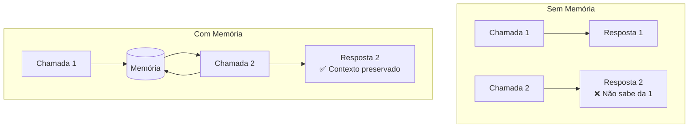
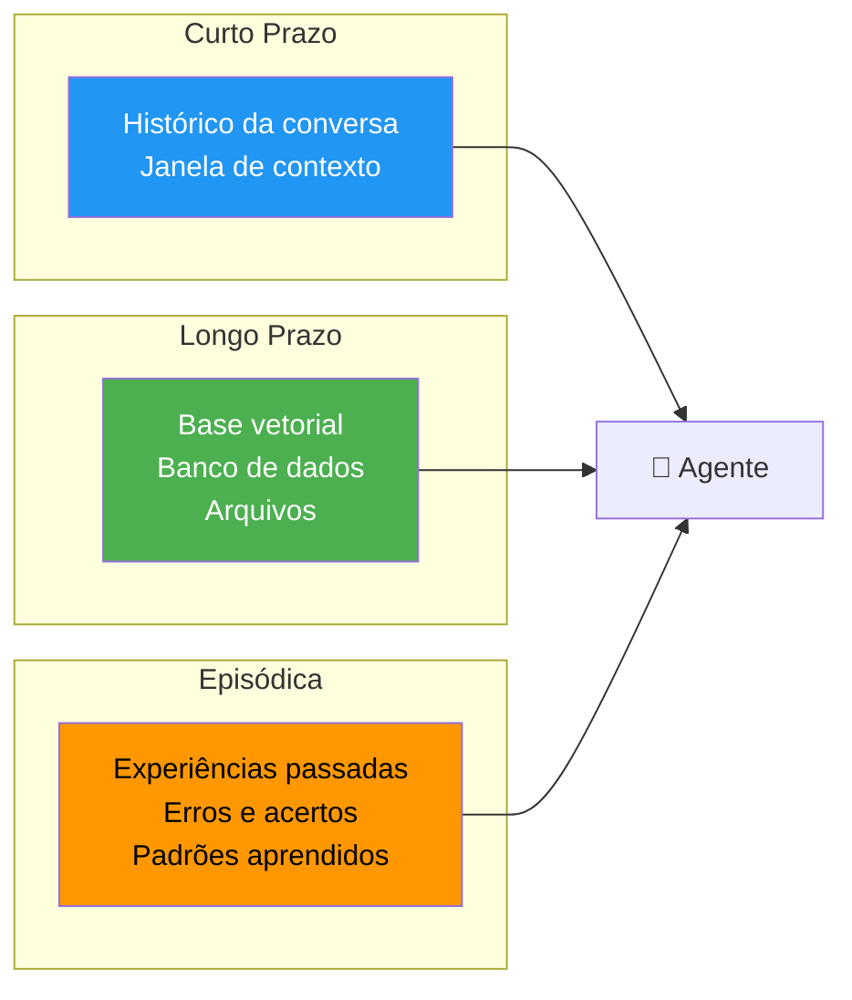
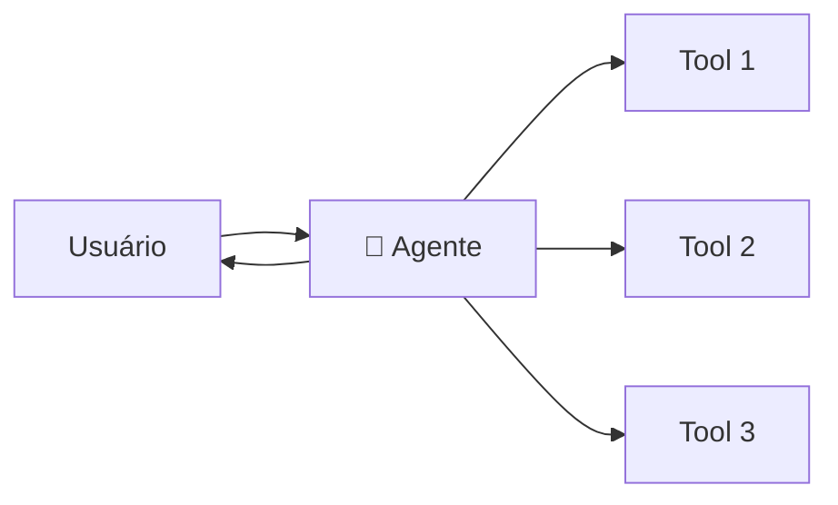
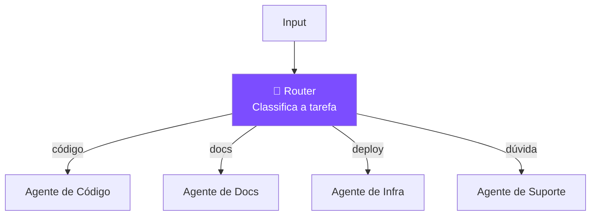
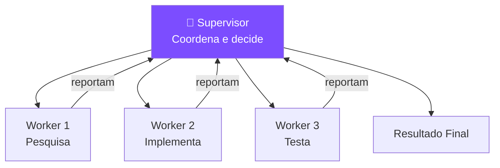
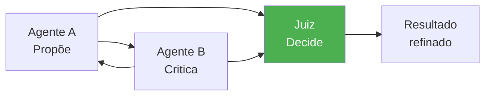

# S02 — Memória, Agentes e Orquestração

## O Problema da Memória

LLMs **não têm memória** entre conversas. Cada chamada é independente. Para agentes que operam em múltiplas etapas, isso é um problema crítico.

---

## Tipos de Memória

| Tipo | Duração | Implementação | Uso |
|------|---------|---------------|-----|
| **Curto prazo** | Uma sessão | Histórico de mensagens | Manter contexto da conversa |
| **Longo prazo** | Persistente | Vector DB, banco relacional | Lembrar preferências, fatos |
| **Episódica** | Persistente | Logs estruturados | Aprender com experiências |

---

## Padrões de Orquestração

### Single Agent (Agente Único)

!!! tip "Quando usar"
    Tarefas simples com poucas ferramentas e escopo bem definido.

---

### Pipeline (Sequencial)

!!! tip "Quando usar"
    Fluxos com etapas bem definidas onde a saída de um alimenta o próximo.

---

### Router (Roteador)

!!! tip "Quando usar"
    Múltiplos domínios com especialistas diferentes.

---

### Supervisor (Hierárquico)

!!! tip "Quando usar"
    Tarefas complexas que exigem coordenação entre múltiplos agentes especializados.

---

### Multi-Agent Debate

!!! tip "Quando usar"
    Decisões que se beneficiam de perspectivas opostas (ex: segurança vs usabilidade).

---

## Comparativo de Padrões

| Padrão | Complexidade | Controle | Melhor para |
|--------|-------------|----------|-------------|
| Single Agent | ⭐ | Total | Tarefas simples |
| Pipeline | ⭐⭐ | Alto | Fluxos sequenciais |
| Router | ⭐⭐ | Alto | Multi-domínio |
| Supervisor | ⭐⭐⭐ | Médio | Tarefas complexas |
| Multi-Agent | ⭐⭐⭐⭐ | Baixo | Decisões críticas |

!!! danger "Mais agentes ≠ melhor"
    Cada agente adicional aumenta latência, custo e superfície de erro. Use o padrão mais simples que resolve o problema.
