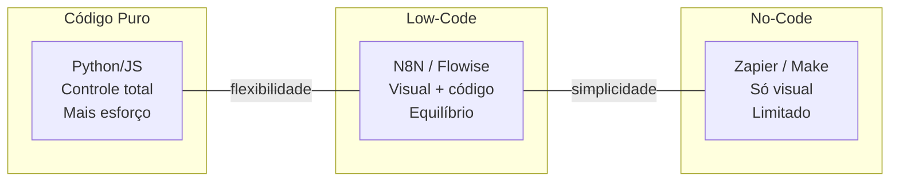
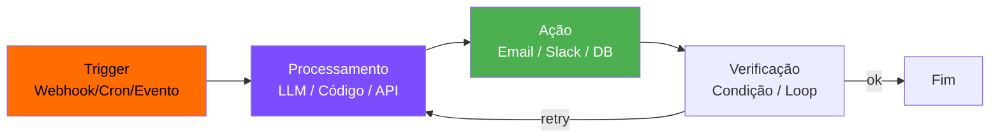
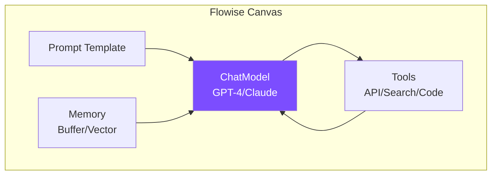
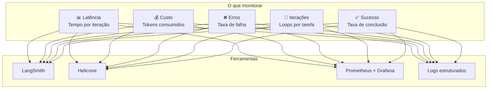

# S03 — Low Code, Flowise, N8N e Monitoramento

## Plataformas Low-Code para IA

Plataformas low-code permitem criar agentes e automações **visualmente**, sem escrever todo o código do zero.

---

## N8N — Automação com IA

O N8N é uma plataforma de automação **self-hosted** que conecta serviços via workflows visuais.

### Casos de uso com IA

| Caso | Trigger | LLM faz | Ação |
|------|---------|---------|------|
| Resumo de PR | Webhook GitHub | Analisa diff | Comenta no PR |
| Triagem de tickets | Novo ticket | Classifica prioridade | Atribui equipe |
| Docs automáticas | Push em main | Gera changelog | Atualiza wiki |
| Alerta inteligente | Log de erro | Analisa causa raiz | Notifica Slack |

---

## Flowise — Agentes Visuais

Flowise permite construir **chains e agentes LangChain** visualmente.

### Quando usar cada um

| | N8N | Flowise |
|---|---|---|
| **Foco** | Automação de workflows | Agentes conversacionais |
| **Força** | Integrações (500+ conectores) | Chains LangChain visuais |
| **IA** | Nó de LLM no fluxo | Agente completo com memória |
| **Deploy** | Self-hosted, Docker | Self-hosted, Docker |
| **Melhor para** | Automações com IA | Chatbots e RAG |

---

## Monitoramento de Agentes

!!! danger "Agentes em produção PRECISAM de observabilidade"
    Sem monitoramento, você não sabe se o agente está funcionando, errando ou gastando demais.

### Métricas essenciais

### Checklist de produção

- [ ] Logs estruturados em cada decisão do agente
- [ ] Alerta quando custo/iterações excedem threshold
- [ ] Dashboard com taxa de sucesso/falha
- [ ] Trace completo de cada execução (input → decisões → output)
- [ ] Fallback definido para quando o agente falha

!!! tip "Regra prática"
    Se você não consegue explicar **por que** o agente tomou uma decisão olhando os logs, seu monitoramento é insuficiente.
