# S03 — Low Code, N8N, Flowise e Monitoramento de IA

!!! info "Estrutura da Semana"
    - **Aula 1** — N8N: conceito, triggers, nós, projetos práticos
    - **Aula 2** — Flowise: agentes visuais, RAG, integração com N8N
    - **Aula 3** — Qualidade & Observabilidade: Langfuse, MLflow, LLM-as-Judge

---

## O que é Low Code?

Uma abordagem de desenvolvimento que **reduz a necessidade de codificação manual**, usando interfaces visuais de arrastar e soltar para criar aplicações e automações.

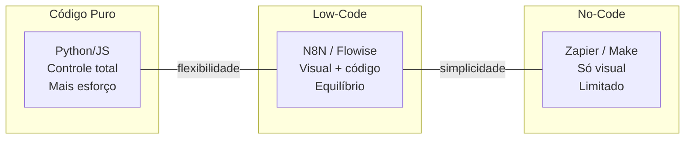

**Principal benefício:** permitir que pessoas sem conhecimento avançado de programação criem aplicações e automações rapidamente.

---

## Aula 1 — N8N

### O que é N8N?

N8N é uma **plataforma open-source de automação** de fluxos de trabalho que conecta diferentes serviços e APIs.

| N8N é... | Por que usar? |
|----------|--------------|
| Plataforma open-source de automação | Sem custo de licença (self-hosted) |
| Interface visual de arrastar e soltar | Fluxos complexos sem código |
| Self-hosted: você controla seus dados | Fácil integração com LLMs e APIs |
| Mais de 400 integrações nativas | Ativo, frequência alta e webhooks nativos |
| Suporte a JavaScript quando precisar | Comunidade grande e templates prontos |

### Instalação Local

=== "Docker (recomendado)"

    ```bash
    docker run -it --rm --name n8n -p 5678:5678 \
      -v ~/.n8n:/home/node/.n8n n8nio/n8n
    # Acessar em: http://localhost:5678
    ```

=== "NPM"

    ```bash
    npx n8n    # ou:    npm install -g n8n && n8n start
    ```

!!! tip "Primeiro acesso"
    Crie sua conta de admin. Dados ficam em `~/.n8n`

### Duas Formas de Rodar

| | N8N Cloud | Self-Hosted (Docker) |
|---|---|---|
| **Vantagens** | Pronto em 2 min, sem Docker, integrações nativas, trial 14 dias | Controle total dos dados, sem limites, gratuito para sempre, OAuth próprio |
| **Limitações** | Limitado no trial, dados na nuvem | Requer Docker instalado, OAuth mais trabalhoso |

!!! tip "Recomendação"
    Para aula: use N8N Cloud. Para produção com dados sensíveis: Self-Hosted.

### Setup N8N Cloud

1. Acessar n8n.io → clicar em 'Get started for free'
2. Criar conta com email — trial de 14 dias gratuito
3. N8N provisiona o workspace automaticamente
4. Acessar o dashboard → clicar em 'New Workflow'
5. Pronto — interface completa sem instalação

URL do workspace: `https://seu-nome.app.n8n.cloud`

### Setup Self-Hosted com Docker Compose (recomendado)

```yaml
services:
  n8n:
    image: n8nio/n8n
    ports:
      - "5678:5678"
    volumes:
      - ~/.n8n:/home/node/.n8n
      - ./arquivos:/data/files    # montar pasta local
    environment:
      - N8N_BASIC_AUTH_ACTIVE=true
      - N8N_BASIC_AUTH_USER=admin
      - N8N_BASIC_AUTH_PASSWORD=senha123
```

```bash
docker compose up -d    # subir
docker compose ps       # verificar status
```

---

### Triggers: Como seu Fluxo Começa

No N8N, um **trigger** é o evento que inicia a execução do workflow.

| Trigger | Descrição |
|---------|-----------|
| **Webhook** | Recebe requisições HTTP de qualquer app. Gera URL única, suporta GET/POST/PUT |
| **Schedule** | Executa em intervalos definidos. Cron nativo ou seletor visual |
| **Manual** | Acionado por você na interface. Ideal para testes e desenvolvimento |
| **App Events** | Reage a eventos de apps conectados: novo email, novo arquivo, nova mensagem |

---

### Nós Essenciais

| Nó | Função | Exemplo |
|----|--------|---------|
| **Set** | Define ou transforma variáveis no fluxo | `{{ $json.body.name.toUpperCase() }}` |
| **IF** | Divide o fluxo com base em condição | `{{ $json.score }} > 7` |
| **Merge** | Combina outputs de múltiplos nós | Merge by position / key / append |
| **HTTP Request** | Chama qualquer API REST externa | `GET https://api.openai.com/v1/...` |
| **Code** | JavaScript puro quando precisar | `return items.map(i => ({...i.json}))` |

---

### HTTP Request: Chamando APIs Externas

Configuração do nó HTTP Request:

| Campo | Opções |
|-------|--------|
| **Method** | GET / POST / PUT / DELETE |
| **URL** | `https://api.exemplo.com/endpoint` |
| **Auth** | Bearer Token · API Key · Basic · OAuth2 |
| **Headers** | Content-Type: application/json |
| **Body** | JSON · Form Data · Raw · Binary |

**Expressão dinâmica no body:**
```json
{ "prompt": "{{ $json.body.question }}", "model": "gpt-4o" }
```

---

### ⚡ Projeto 1 — Fluxo: Webhook + Schedule + Log

!!! example "Objetivo"
    Criar um fluxo que recebe dados via webhook E roda automaticamente por schedule, registrando tudo.

**Passos:**

1. Criar fluxo → Add Trigger → Webhook (POST /log-event)
2. Adicionar nó Set para formatar o payload recebido
3. Adicionar trigger Schedule (a cada 1 hora) no mesmo fluxo
4. Usar nó IF para separar origem (webhook vs. schedule)
5. Nó Code para montar objeto de log com timestamp

#### Primeiro Fluxo: Webhook + Set + Resposta

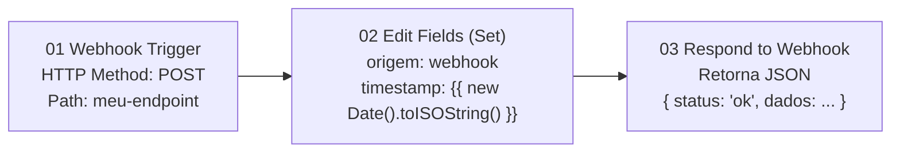

**Testar com curl:**
```bash
curl -X POST http://localhost:5678/webhook-test/meu-endpoint \
  -H "Content-Type: application/json" \
  -d '{"evento": "teste", "usuario": "hellen"}'
```

!!! tip "N8N Cloud"
    Usar a URL gerada automaticamente no nó Webhook (botão 'Copy URL')

---

### ⚡ Projeto 2 — Agente Q&A: Webhook + LLM + Resposta

!!! example "Objetivo"
    Construir um agente que recebe pergunta via webhook, consulta LLM e retorna resposta HTTP.

**Passos:**

1. Trigger Webhook POST /ask — captura campo `question` do body
2. Nó Set para formatar prompt: `'Responda em PT-BR: {{ $json.body.question }}'`
3. HTTP Request → POST `https://api.openai.com/v1/chat/completions`
4. Nó Set para extrair resposta: `{{ $json.choices[0].message.content }}`
5. Nó Respond to Webhook com JSON: `{ answer: '{{ $json.resposta }}' }`
6. Testar com curl ou Postman e validar resposta em tempo real


---

### Agente com Tool: Estrutura Completa

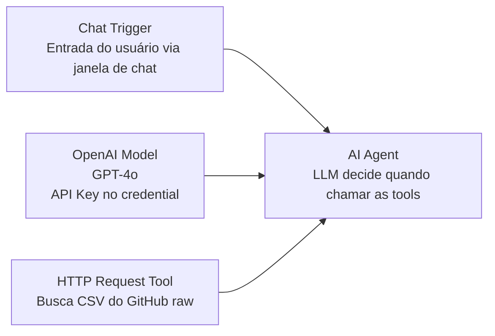

**System Prompt recomendado:**
> "Você é analista de dados. SEMPRE use a tool ler pedidos antes de responder sobre pedidos."

---

### Problemas Comuns e Soluções

| ❌ Problema | ✅ Solução |
|------------|-----------|
| Porta já em uso (ex: 3000, 5678) | Trocar no docker-compose: '3001:3000' |
| Docker daemon parado | Abrir Docker Desktop e aguardar iniciar |
| fs / fetch / $http bloqueado no Code Tool | Usar HTTP Request Tool nativo — sem restrições |
| OAuth Google: 'App not verified' | Adicionar email em Test Users ou usar N8N Cloud |
| Agente não usa a tool | Melhorar description da tool e System Prompt |
| CSV no container não encontrado | Mapear volume no docker-compose: `./pasta:/data/files` |

---

### RAG com N8N + Supabase

#### O que é RAG?

**Retrieval-Augmented Generation** — o LLM responde com base em documentos seus.

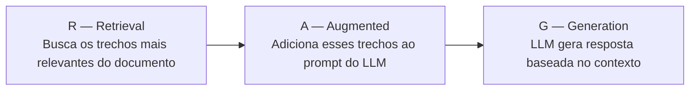

**Por que usar?**

- LLM não sabe do seu documento — RAG dá esse conhecimento
- Respostas baseadas em fatos reais, não em 'achismos' do modelo
- Funciona com manuais, PDFs, documentações, bases de conhecimento

#### Arquitetura Completa

**INGESTION (uma vez — popula o banco):**

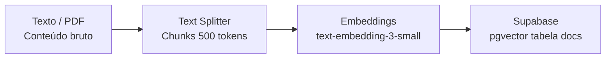

**INFERENCE (cada pergunta — consulta o banco):**

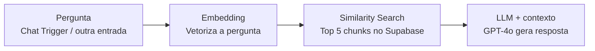

!!! info "Supabase aparece nos dois pipelines"
    Salva no Ingestion e busca no Inference.

#### Setup: Supabase

**1. Criar conta e projeto:**

1. supabase.com → New Project → Region: South America
2. Guardar a senha do banco — usada na connection string

**2. SQL: Ativar extensão e criar tabela:**

```sql
-- Ativar pgvector
create extension if not exists vector;

-- Criar tabela
create table documents (
  id bigserial primary key,
  content text,
  metadata jsonb,
  embedding vector(1536)
);
```

**3. Credencial no N8N:**

- Settings → Credentials → New → Supabase API
- Host: `https://SEU-PROJETO.supabase.co` + Service Role Key (Settings → API)

#### SQL: Função match_documents

Necessária para o N8N buscar chunks por similaridade no Supabase:

```sql
create or replace function match_documents (
  query_embedding vector(1536),
  match_count int default 5,
  filter jsonb default '{}'
) returns table (
  id bigint,
  content text,
  metadata jsonb,
  similarity float
)
language plpgsql
as $$
begin
  return query
    select
      documents.id,
      documents.content,
      documents.metadata,
      1 - (documents.embedding <=> query_embedding) as similarity
    from documents
    where documents.metadata @> filter
    order by documents.embedding <=> query_embedding
    limit match_count;
end;
$$;
```

!!! warning "Rodar no SQL Editor do Supabase antes de testar o fluxo de Inference no N8N"

#### Fluxo de Ingestion no N8N

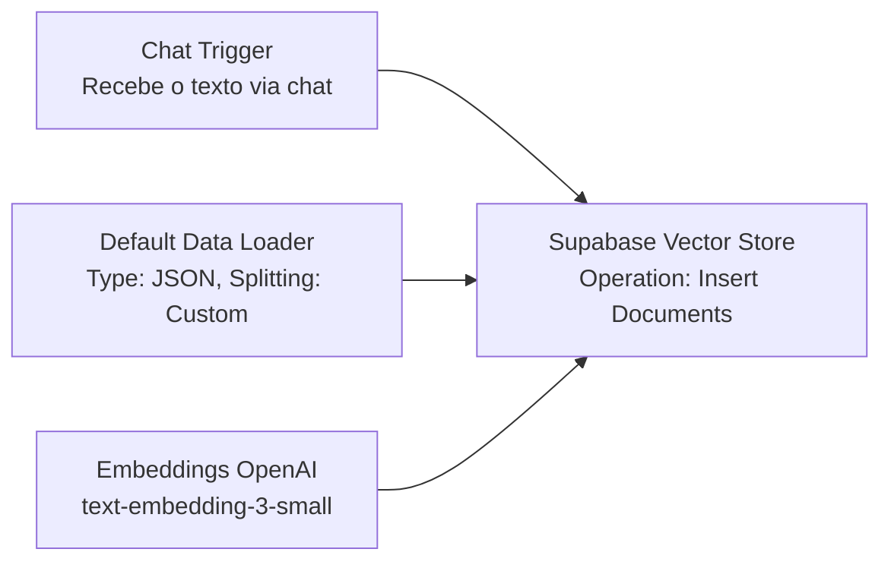

!!! tip "Default Data Loader e Embeddings são sub-nós do Supabase Vector Store — conectar pelo '+'"

#### Fluxo de Inference no N8N

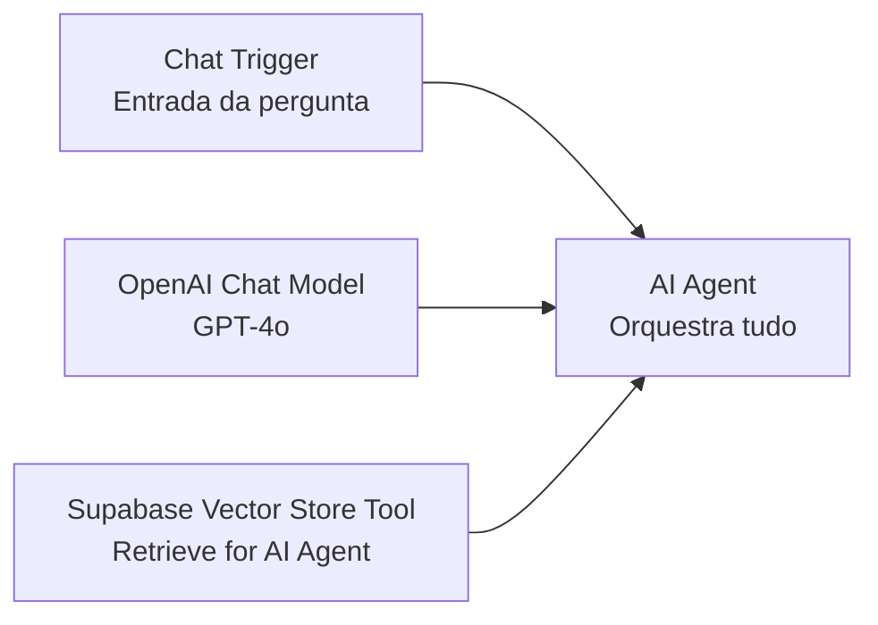

**System Prompt do Agente:**
> "Responda APENAS com base nos documentos encontrados. Se não encontrar, diga que não está no documento."

#### Verificando os Dados no Supabase

```sql
-- Ver chunks salvos
select id, content, metadata from documents limit 5;

-- Ver os embeddings (vetores)
select id, content, embedding from documents limit 1;

-- Contar quantos chunks foram salvos
select count(*) from documents;

-- Ver os metadados de cada chunk
select id, metadata->>'source' as fonte, length(content) as tamanho
from documents order by id;
```

!!! info "O embedding é um array de 1536 números — representa o significado semântico do chunk"


---

## Aula 2 — Flowise

### Fluxo vs. Agente

| Fluxo (N8N) | Agente (Flowise / AutoGPT) |
|-------------|---------------------------|
| Passos determinísticos e previsíveis | O LLM decide o próximo passo |
| Você define cada decisão no design | Usa ferramentas para agir no mundo |
| Ideal para automações repetitivas | Loop: Raciocinar → Agir → Observar |
| Execução linear ou condicional | Ideal para tarefas abertas e complexas |
| Resultado esperado e controlado | Resultado emergente, menos previsível |

!!! tip "Combinação ideal"
    N8N orquestra o fluxo → chama agente Flowise quando precisar de raciocínio.

### Flowise: Conceitos e Interface

- **Chatflow**: canvas visual onde você monta o pipeline do agente
- **Node**: cada bloco funcional (LLM, memory, vector store, tool)
- **Chain**: sequência de nodes conectados — pergunta entra, resposta sai
- **Agent**: LLM com acesso a ferramentas — decide quando e como usá-las
- **Tool**: função que o agente pode chamar (busca, cálculo, API)

**Instalação:**
```bash
npx flowise start    # porta padrão: 3000
# ou via Docker:
docker run -d -p 3000:3000 flowiseai/flowise
```

### RAG no Flowise: Pipeline de Ingestion

O que é Ingestion? → **Processar e indexar documentos na vector store**

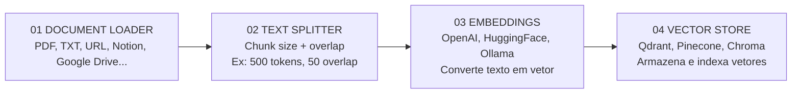

### RAG no Flowise: Pipeline de Inference

O que é Inference? → **Responder perguntas usando os docs indexados**

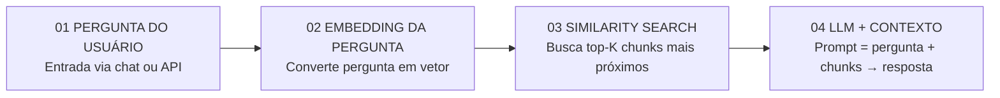

### ⚡ Desafio — Chatbot RAG do Zero com Flowise (30 min)

!!! example "Objetivo"
    Criar chatbot que responde perguntas sobre um PDF usando RAG no Flowise.

1. Abrir Flowise → New Chatflow → arrastar PDF File Loader
2. Adicionar Recursive Character Text Splitter (500/50)
3. Adicionar OpenAI Embeddings e conectar ao Qdrant / Chroma
4. Nó Conversational Retrieval QA Chain conectando tudo
5. Testar via chat embutido: perguntar sobre conteúdo do PDF
6. Expor como API: copiar URL → usar no próximo projeto

### Conectando Flowise ao N8N

Flowise expõe seus agentes como **API REST**:

```bash
# Endpoint gerado pelo Flowise:
POST http://localhost:3000/api/v1/prediction/<chatflow-id>
Body: { "question": "Qual é o prazo de entrega?" }
Response: { "text": "O prazo é de 3 dias úteis." }
```

**No N8N: HTTP Request node chamando o Flowise:**

```
Method: POST
URL:    http://flowise:3000/api/v1/prediction/{{ $env.FLOWISE_ID }}
Auth:   Bearer {{ $env.FLOWISE_API_KEY }}
Body (JSON):
{
    "question": "{{ $json.body.userMessage }}",
    "overrideConfig": { "sessionId": "{{ $json.body.userId }}" }
}
```

!!! info "Resultado do Flowise entra no próximo nó do N8N como `$json.text`"

### ⚡ Projeto 2 — Agente Flowise Chamado pelo N8N (30 min)

!!! example "Objetivo"
    N8N recebe mensagem do usuário → chama agente RAG no Flowise → retorna resposta.

1. N8N: Trigger Webhook POST /chat com campo `message` e `userId`
2. N8N: Nó Set formata payload: `{ question, sessionId }`
3. N8N: HTTP Request → POST para endpoint do Flowise
4. N8N: Nó Set extrai `$json.text` como resposta final
5. N8N: Respond to Webhook retorna `{ reply: resposta }`


---

## Aula 3 — Qualidade & Observabilidade

### Por que Medir Agentes é Diferente?

Software tradicional tem outputs determinísticos. Agentes são **não-determinísticos** por natureza — o mesmo input pode gerar outputs diferentes, caminhos diferentes, custos diferentes.

| Software Tradicional | Agentes LLM |
|---------------------|-------------|
| ✅ Output determinístico (mesma entrada → mesma saída) | ⚠️ Output não-determinístico (respostas variam) |
| ✅ Testes unitários funcionam (assertEqual) | ⚠️ Testes unitários insuficientes ("correto" é subjetivo) |
| ✅ Custo fixo por operação (CPU/memória previsíveis) | ⚠️ Custo variável por run (tokens variam) |
| ✅ Erros são exceptions (stack trace claro) | ⚠️ Erros são silenciosos (resposta errada mas válida) |
| ✅ Latência previsível (benchmarks estáveis) | ⚠️ Latência imprevisível (depende de tool calls, LLM, contexto) |

---

### Métricas de Agentes — O que Medir?

Métricas de agentes cobrem **3 dimensões**: operacional (custo, latência), comportamental (tool use, erros) e qualitativa (relevância, fidelidade, utilidade).

#### ⚡ Operacional

| Métrica | Descrição | Fórmula |
|---------|-----------|---------|
| **Latência total** | Tempo do primeiro token ao último — inclui todas as tool calls | `end_time - start_time` |
| **Latência por step** | Tempo de cada chamada LLM e cada tool individualmente | `step_end - step_start` |
| **Custo por run** | Tokens de input + output × preço do modelo | `(input_tokens × p_in) + (output_tokens × p_out)` |
| **Número de tool calls** | Quantas ferramentas o agente chamou por sessão | `count(tool_calls)` |

#### 🎯 Comportamental

| Métrica | Descrição | Fórmula |
|---------|-----------|---------|
| **Tool accuracy** | Proporção de tool calls corretas (nome + parâmetros) | `correct_calls / total_calls` |
| **Taxa de erro** | % de runs que falharam ou retornaram resultado inválido | `failed_runs / total_runs` |
| **Steps até conclusão** | Número de iterações do agente para completar a task | `count(agent_steps)` |

#### 🌟 Qualitativa

| Métrica | Descrição | Avaliação |
|---------|-----------|-----------|
| **Fidelidade (Faithfulness)** | Resposta está alinhada com o contexto recuperado? | LLM-as-Judge (0-1) |
| **Relevância da resposta** | A resposta realmente responde o que foi perguntado? | LLM-as-Judge (0-1) |
| **Utilidade** | A resposta é útil e acionável para o usuário? | Human eval / LLM-Judge |
| **Groundedness** | Resposta baseada em fatos verificáveis ou inventou? | LLM-as-Judge (0-1) |

---

### Langfuse — Observabilidade Específica de LLM

Langfuse é uma plataforma **open-source de observabilidade para LLMs**. Diferente de ferramentas genéricas, é desenhada especificamente para traces de LLMs, tool calls e avaliações.

#### Conceitos Fundamentais

| Conceito | Descrição |
|----------|-----------|
| **Trace** | Uma execução completa do agente — do input do usuário ao output final. Engloba tudo |
| **Span** | Um step dentro do trace — uma chamada ao LLM, uma tool call, um bloco de código. Aninhado no trace |
| **Generation** | Tipo especial de span para chamadas ao LLM. Registra tokens, modelo, custo, latência |
| **Score** | Avaliação de um trace ou span — pode ser manual (humano) ou automática (LLM-as-Judge) |

#### Instrumentando o Agente com Langfuse

```python
from langfuse import Langfuse
from langfuse.decorators import observe, langfuse_context

langfuse = Langfuse()

# @observe instrumenta automaticamente
@observe(name="agente-analista")
def run_agent(problema: str):
    # Registra metadados do trace
    langfuse_context.update_current_trace(
        user_id="dev-turma",
        tags=["producao", "analista"]
    )

    # Cada LLM call vira um span de Generation
    resposta = call_llm(problema)

    # Tool call também é rastreada
    dados = search_db(problema)

    # Score manual de qualidade
    langfuse_context.score_current_trace(
        name="utilidade",
        value=0.9,
        comment="Resposta relevante e acionável"
    )
    return resposta

# Visualize no dashboard: localhost:3000
```

#### O que Você Vê no Dashboard

| Métrica | Exemplo |
|---------|---------|
| Total de Traces | 1.247 (últimas 24h) |
| Custo Total | R$ 4,82 (input + output tokens) |
| Latência Média | 3,4s (p50 / p95: 8,1s) |
| Score Médio | 0,81 (LLM-as-Judge 0-1) |

**O que analisar no Langfuse:**

- 💰 **Custo por modelo** — Qual LLM está gastando mais? GPT-4o vs GPT-4o-mini?
- 🐌 **Gargalos de latência** — Qual step demora mais? Tool call ou LLM generation?
- ❌ **Traces com falha** — Filtrar runs que falharam e ver onde quebrou
- 📊 **Distribuição de scores** — Histograma de qualidade — onde está caindo abaixo de 0.7?
- 🔄 **Comparar modelos** — Side-by-side de Claude vs GPT no mesmo trace

---

### MLflow — Experiment Tracking para Agentes

MLflow registra e compara **experimentos** — diferentes versões do agente, diferentes modelos, diferentes prompts. Enquanto Langfuse foca em produção, MLflow foca em **desenvolvimento e iteração**.

| Langfuse | MLflow |
|----------|--------|
| Observabilidade em PRODUÇÃO — traces ao vivo, custo real, erros em produção, avaliação de usuários reais | Experiment tracking em DESENVOLVIMENTO — comparar runs, versionar prompts, decidir qual modelo usar antes de ir pra produção |

#### Conceitos do MLflow

| Conceito | Descrição |
|----------|-----------|
| **Experiment** | Agrupamento de runs relacionados (ex: 'teste-modelos-dia1') |
| **Run** | Uma execução específica com seus parâmetros e métricas |
| **Params** | Configurações usadas: modelo, temperatura, max_tokens, prompt |
| **Metrics** | Valores numéricos: latência, custo, score, tool_accuracy |
| **Artifacts** | Arquivos salvos: prompts, outputs, gráficos, modelos |

#### Código de Exemplo

```python
import mlflow

# Inicia o experiment
mlflow.set_experiment("comparacao-modelos-dia3")

for modelo in ["gpt-4o", "claude-sonnet-4-6", "gemini-2.0"]:
    with mlflow.start_run(run_name=modelo):
        # Loga parâmetros do experimento
        mlflow.log_params({
            "modelo": modelo,
            "temperatura": 0.7,
            "max_tokens": 2000,
            "prompt_version": "v2.1"
        })

        # Executa o agente e coleta métricas
        resultado = run_agent(problema, modelo=modelo)

        # Loga métricas numéricas
        mlflow.log_metrics({
            "latencia_s": resultado.latencia,
            "custo_usd": resultado.custo,
            "score_judge": resultado.score,
            "tool_accuracy": resultado.tool_accuracy
        })
```

---

### LLM-as-Judge — Avaliação Automática de Qualidade

Um **Judge** é um modelo de linguagem (LLM) usado para avaliar as respostas de outro agente. Em vez de métricas simples como acurácia, o Judge entende contexto, nuance e qualidade — assim como um avaliador humano faria.

!!! quote "O Judge não verifica se a resposta está certa — ele avalia se ela é BOA."

#### O Problema de Escala

| Método | Prós | Contras |
|--------|------|---------|
| **Avaliação humana** | Alta precisão | Não escala — impossível avaliar 1.000 respostas/dia |
| **Testes unitários** | Rápido e barato | Só funciona para outputs determinísticos — não mede 'qualidade' |
| **LLM-as-Judge** | Escala, rápido, customizável | Viés do modelo juiz, pode ser inconsistente |

#### Implementação

```python
def avaliar_resposta(pergunta, contexto, resposta):
    prompt = f"""
    Você é um avaliador especializado.
    Avalie a resposta em 3 dimensões (0.0 a 1.0):

    PERGUNTA: {pergunta}
    CONTEXTO: {contexto}
    RESPOSTA: {resposta}

    Retorne JSON:
    {{
      "fidelidade": <0-1>,  // usa o contexto?
      "relevancia": <0-1>,  // responde a pergunta?
      "utilidade":  <0-1>   // é acionável?
    }}
    """
    resultado = llm_chat(prompt)
    return json.loads(resultado)
```

#### Tipos de Judge

| Tipo | Descrição | Recebe | Retorna |
|------|-----------|--------|---------|
| **Simples** | Avalia a resposta isolada. Ideal para monitoramento geral em produção | pergunta + resposta | score (0-1) + justificativa |
| **Com Referência** | Compara com resposta esperada. Ideal para detectar regressão em datasets | pergunta + resposta + esperada | score (0-1) + justificativa |
| **Comportamental** | Avalia o processo, não só o resultado. Verifica ferramentas e passos | pergunta + ferramentas + resposta | score (0-1) + justificativa |

#### Como Funciona na Prática

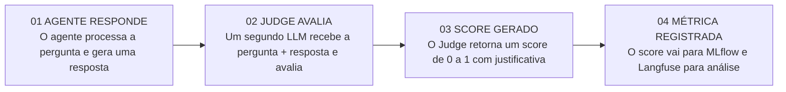

#### Judge + Métricas: O que Cada Um Responde

| Pergunta | Métrica | Tipo |
|----------|---------|------|
| A resposta foi boa? | Judge score | JUDGE |
| O agente usou a ferramenta certa? | Tool accuracy | COMPORTAMENTAL |
| O agente foi eficiente? | Steps até conclusão | COMPORTAMENTAL |
| O sistema está estável? | Taxa de erro | MLFLOW |
| A qualidade regrediu? | Judge + dataset fixo | REGRESSÃO |

#### Boas Práticas com Judge

1. **Use um modelo diferente para o Judge** — Evite que o modelo avalie a si mesmo. Use claude-haiku para julgar respostas do claude-opus — mais barato e sem viés
2. **Peça sempre JSON no prompt** — Inclua no prompt: "Responda APENAS com JSON válido, sem markdown". Adicione try/except para lidar com falhas de parse
3. **Defina critérios claros** — Descreva exatamente o que cada score significa. Scores vagos geram avaliações inconsistentes e difíceis de comparar
4. **Combine com baseline** — O score isolado não diz nada. Compare sempre com um baseline fixo para saber se melhorou ou regrediu

---

### Comparando LLMs — Framework de Análise

| Dimensão | GPT-4o | Claude Sonnet | Gemini 2.0 |
|----------|--------|---------------|------------|
| **Latência** | ⚡ Rápido (~2s) | 🐌 Médio (~3s) | ⚡ Muito rápido (~1.5s) |
| **Custo / run** | 💰 Médio ($0.01-0.03) | 💰 Similar ao GPT | 💸 Mais barato |
| **Tool Accuracy** | ✅ Muito boa | ✅ Excelente | ✅ Boa |
| **Qualidade (Judge)** | ⭐ Alta (0.85) | ⭐ Alta (0.88) | ⭐ Alta (0.83) |
| **Verbosidade** | 📝 Médio | 📝 Alto (mais detalhado) | 📝 Conciso |

!!! warning "Esses valores são estimativas — o live coding vai mostrar os números reais do ambiente de vocês com os dados reais."

---

### Langfuse + MLflow — Usando os Dois Juntos

A combinação ideal: **Langfuse rastreia tudo em tempo real** (observabilidade), **MLflow compara experimentos** (desenvolvimento). Um alimenta o outro.

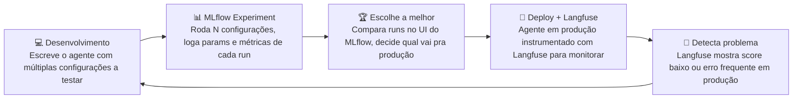

---

### Setup dos Exercícios

**Repositório:** `agentes_B2_S01-02 / exemplos_exercicios / agentes / semana3_monitoramento`

Estrutura:
```
├── 1_exemplo/
├── 2_llm_as_judge.py
├── 3_mlflow/
├── exercicio_sala_1/
├── exercicio_sala_2/
├── exercicios_sala_extra/
└── docker-compose.yml
```

**Setup:**

- Langfuse: Criar conta em [cloud.langfuse.com/auth/sign-up](https://cloud.langfuse.com/auth/sign-up)
- MLflow: Docker, porta 5001 — `http://localhost:5001/`
- Credenciais do Langfuse no `.env` (Settings → API Keys)

