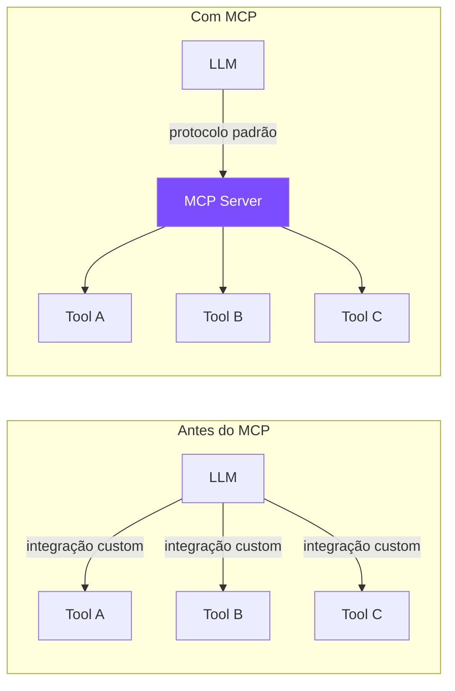
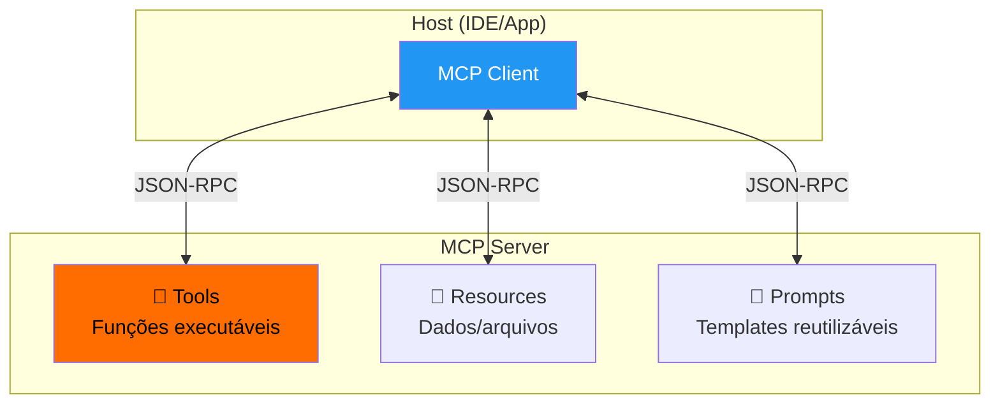
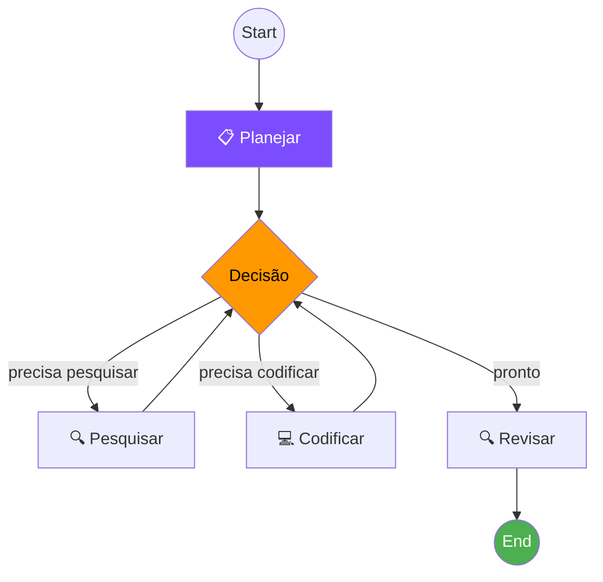
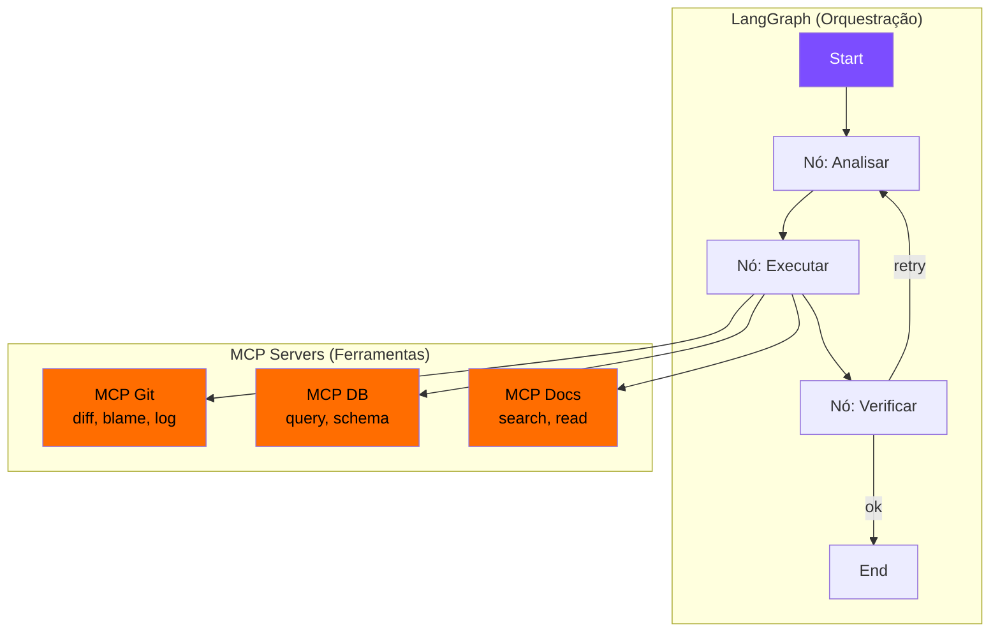

# S04 — MCP, LangGraph e Agentes Estruturados

## MCP — Model Context Protocol

O MCP é um **protocolo aberto** que padroniza como LLMs se conectam a ferramentas e fontes de dados externas.



### Analogia

!!! info "MCP é como USB para IAs"
    Assim como USB padronizou a conexão de periféricos, MCP padroniza a conexão de ferramentas a LLMs. Qualquer LLM compatível pode usar qualquer servidor MCP.

### Arquitetura



### Componentes MCP

| Componente | Função | Exemplo |
|-----------|--------|---------|
| **Tools** | Ações que o LLM pode executar | `query_database`, `create_file` |
| **Resources** | Dados que o LLM pode ler | Arquivos, schemas, configs |
| **Prompts** | Templates reutilizáveis | Prompts de análise, review |

---

## LangGraph — Grafos de Agentes

LangGraph permite construir agentes como **grafos de estado**, com controle explícito sobre fluxo e decisões.



### Conceitos-chave

=== "State (Estado)"
    ```python
    class AgentState(TypedDict):
        messages: list[BaseMessage]
        plan: str
        code: str
        review_result: str
    ```
    O estado é compartilhado entre todos os nós do grafo.

=== "Nodes (Nós)"
    ```python
    def plan_node(state: AgentState) -> AgentState:
        # Lógica de planejamento
        plan = llm.invoke("Planeje a tarefa...")
        return {"plan": plan.content}
    ```
    Cada nó é uma função que recebe e retorna estado.

=== "Edges (Arestas)"
    ```python
    def should_continue(state: AgentState) -> str:
        if "DONE" in state["review_result"]:
            return "end"
        return "revise"
    ```
    Arestas condicionais controlam o fluxo.

### LangGraph vs Outros Frameworks

| | LangGraph | LangChain | CrewAI |
|---|---|---|---|
| **Controle de fluxo** | Explícito (grafo) | Implícito (chain) | Implícito (roles) |
| **Estado** | Tipado e compartilhado | Passado entre steps | Por agente |
| **Debugging** | Fácil (visualiza grafo) | Médio | Difícil |
| **Complexidade** | Média | Baixa | Baixa |
| **Produção** | ✅ Projetado para | ⚠️ Possível | ⚠️ Limitado |

---

## Combinando MCP + LangGraph



!!! success "Benefício"
    - **LangGraph** controla o *fluxo* (quando fazer o quê)
    - **MCP** padroniza as *ferramentas* (como fazer)
    - Juntos: agentes estruturados, testáveis e extensíveis
