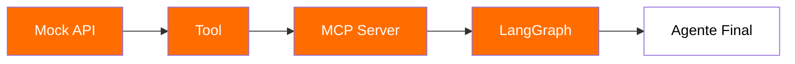
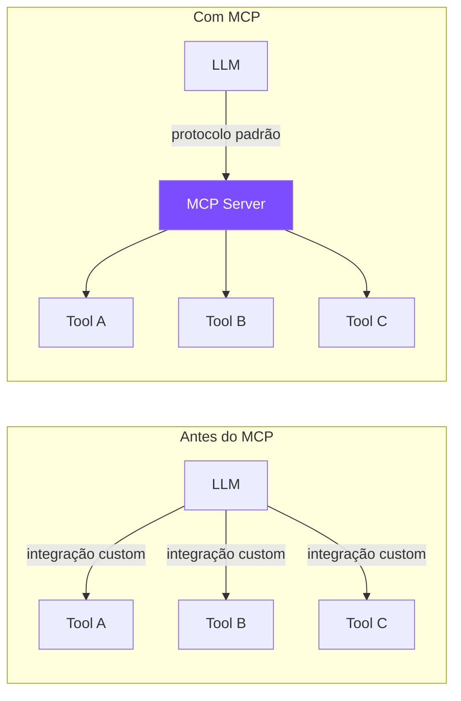
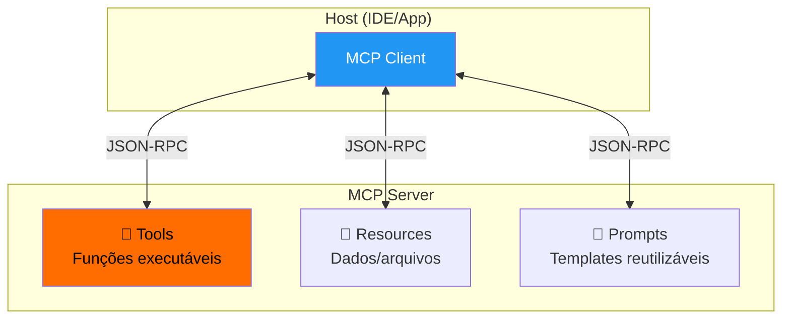
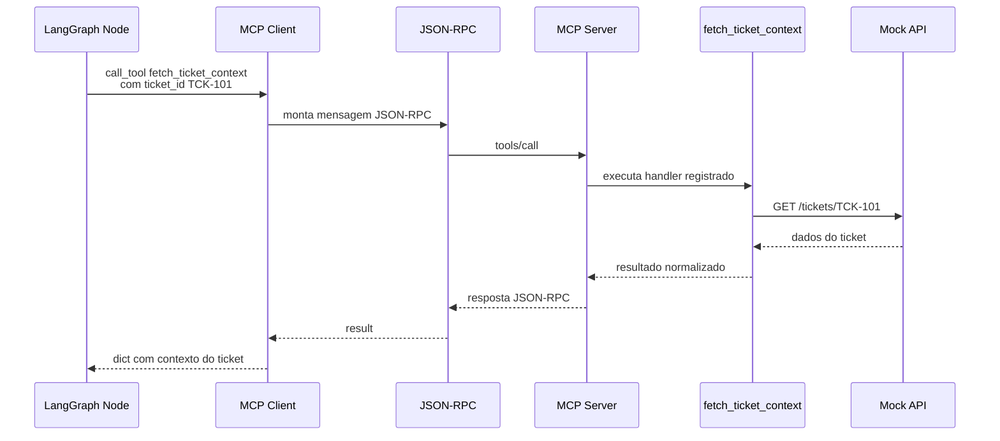
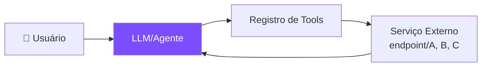
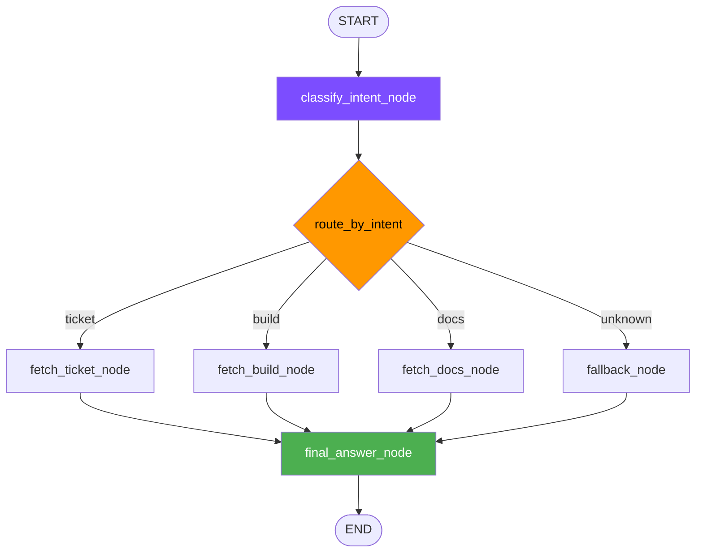
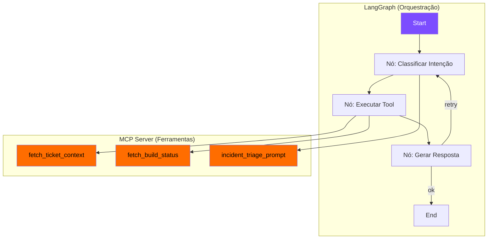

# S04 — MCP, LangGraph e Agentes Estruturados

## Stack Sentinel — O Projeto da Semana

A aula usa um projeto narrativo chamado **Stack Sentinel**: um agente de triagem de incidentes que consulta tickets, builds e documentação para ajudar equipes de suporte.



!!! info "Progressão do projeto"
    - **Dia 1**: Ligar a central, validar o serviço e expor a primeira capacidade
    - **Dia 2**: Expandir MCP (tools, resources, prompts) e começar o grafo
    - **Dia 3**: Integrar tudo e resolver um incidente de ponta a ponta

---

## MCP — Model Context Protocol

O MCP é um **protocolo aberto** que padroniza como LLMs se conectam a ferramentas e fontes de dados externas.



### Analogia

!!! info "MCP é como USB para IAs"
    Assim como USB padronizou a conexão de periféricos, MCP padroniza a conexão de ferramentas a LLMs. Qualquer LLM compatível pode usar qualquer servidor MCP.

### Arquitetura



### Componentes MCP

| Componente | Função | Exemplo no Stack Sentinel |
|-----------|--------|---------|
| **Tools** | Ações que o LLM pode executar | `fetch_ticket_context`, `fetch_build_status` |
| **Resources** | Dados que o LLM pode ler | Documentação interna, runbooks |
| **Prompts** | Templates reutilizáveis de instrução | `incident_triage_prompt` |

### Prompts MCP — Templates Reutilizáveis

Prompts MCP são **templates reutilizáveis de instrução** que padronizam como o agente responde dentro de um domínio.

```python
# Prompt registrado no MCP Server
incident_triage_prompt(user_question, available_context)
```

!!! tip "No Stack Sentinel"
    O prompt `incident_triage_prompt` orienta o agente a fazer triagem de incidente **sem inventar dados** — usando apenas o contexto disponível das tools.

---

## Comunicação JSON-RPC — Como Funciona por Dentro

O agente **não monta JSON-RPC** diretamente. O MCP Client abstrai essa comunicação:



!!! warning "Ponto-chave"
    O LLM/Agente nunca vê JSON-RPC. Ele apenas solicita uma tool call com argumentos tipados — o MCP Client cuida do protocolo.

---

## LangGraph — Grafos de Agentes

LangGraph permite construir agentes como **grafos de estado**, com controle explícito sobre fluxo e decisões.

### Fluxo Básico



O LLM/Agente:

- Decide a intenção
- Decide qual tool usar
- Gera uma resposta

### Conceitos-chave

=== "State (Estado)"
    ```python
    class AgentState(TypedDict):
        input: str           # pergunta do usuário
        intent: str          # intenção classificada
        ids: dict            # identificadores extraídos
        context: dict        # dados retornados pelas tools
        error: str           # erros de execução
        final_answer: str    # resposta final
    ```
    O state é o **contrato de dados** compartilhado entre todos os nós do grafo.

=== "Nodes (Nós)"
    ```python
    def classify_intent_node(state: AgentState, llm) -> AgentState:
        # Classifica a intenção do usuário
        ...
        return {"intent": "ticket", "ids": {"ticket_id": "TCK-101"}}
    ```
    Cada nó é uma função que recebe e retorna estado.

=== "Edges (Arestas)"
    ```python
    def route_by_intent(state: AgentState) -> str:
        intent = state["intent"]
        if intent == "ticket": return "fetch_ticket_node"
        if intent == "build": return "fetch_build_node"
        if intent == "docs": return "fetch_docs_node"
        return "fallback_node"
    ```
    Conditional edges escolhem o próximo nó baseado no state.

### Do Fluxo Linear ao Condicional



### LangGraph vs Outros Frameworks

| | LangGraph | LangChain | CrewAI |
|---|---|---|---|
| **Controle de fluxo** | Explícito (grafo) | Implícito (chain) | Implícito (roles) |
| **Estado** | Tipado e compartilhado | Passado entre steps | Por agente |
| **Debugging** | Fácil (visualiza grafo) | Médio | Difícil |
| **Complexidade** | Média | Baixa | Baixa |
| **Produção** | ✅ Projetado para | ⚠️ Possível | ⚠️ Limitado |

---

## Combinando MCP + LangGraph



---

## Quem Faz o Quê — Resumo

| Componente | Responsabilidade |
|-----------|-----------------|
| **MCP** | Expõe capacidades (tools, resources, prompts) |
| **LangGraph** | Organiza decisões (grafo, state, routing) |
| **LLM** | Interpreta linguagem (classifica, gera resposta) |
| **Service** | Fornece dados (API real ou mock) |

!!! success "Regra de ouro"
    - **MCP** controla o *como* (padroniza acesso a ferramentas)
    - **LangGraph** controla o *quando* (decide o fluxo)
    - **LLM** controla o *o quê* (interpreta e gera)
    - Juntos: agentes estruturados, testáveis e extensíveis

---

## Exercícios Práticos — Stack Sentinel

O projeto é construído incrementalmente em 16 exercícios:

| Exercício | Objetivo | Entregável |
|-----------|----------|-----------|
| **EX00** | Setup e smoke test | `python run.py doctor/setup/mock-api/test ex00` |
| **EX01** | Mock service rodando | Serviço respondendo em `/tickets`, `/builds` |
| **EX02** | Primeira tool | `fetch_ticket_context(ticket_id: str) -> dict` |
| **EX03** | MCP server mínimo | Server registrando a tool |
| **EX04** | Registro da capacidade | Tool acessível via MCP Client |
| **EX05** | Segunda tool | `fetch_build_status(build_id: str) -> dict` |
| **EX06** | Resource MCP | Dados estáticos expostos como resource |
| **EX07** | Prompt MCP | `incident_triage_prompt(user_question, available_context)` |
| **EX08** | MCP Client conectado | Client descobrindo tools/prompts |
| **EX09** | Definir AgentState | Campos: input, intent, ids, context, error, final_answer |
| **EX10** | classify_intent_node | Classificar intenção (ticket/build/docs/unknown) |
| **EX11** | Routing condicional | `route_by_intent` com conditional edges |
| **EX12** | fetch_ticket_node | Node que chama tool via MCP |
| **EX13** | fetch_build_node | Node para consulta de builds |
| **EX14** | fallback_node | Resposta honesta quando fora do domínio |
| **EX15** | final_answer_node | Separar resposta dos dados brutos, citar evidências |

### Princípios dos Exercícios

- **Adaptar API para tool**: padronizar saída para o agente
- **Tratar erro sem vazar detalhe técnico** desnecessário
- **Separar resposta do usuário dos dados brutos**
- **Citar evidências** quando disponíveis
- **Sugerir próximo passo** acionável
- **Manter fallback honesto** quando não houver contexto
