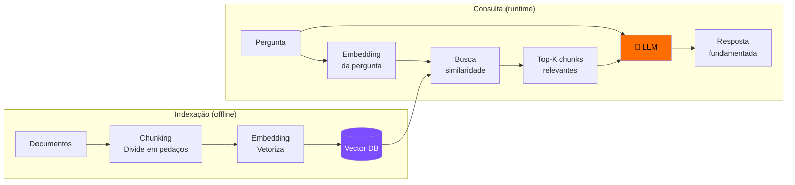
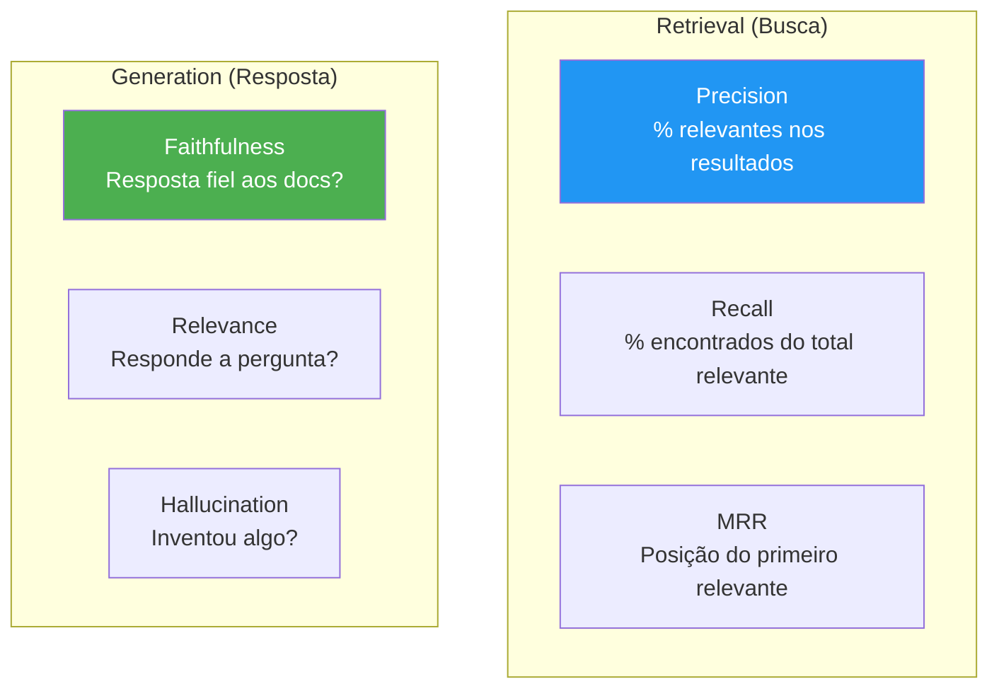
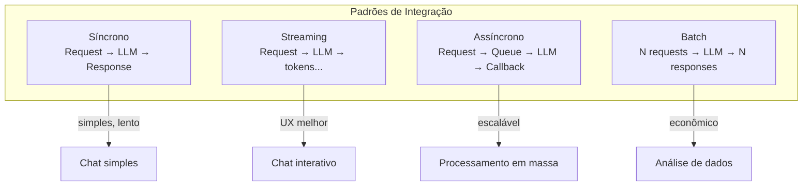

# S05 — RAG, Integração de LLMs e Avaliação

## RAG — Retrieval-Augmented Generation

RAG resolve o problema de LLMs não conhecerem **seus dados específicos**.



### Por que RAG?

| Abordagem | Prós | Contras |
|-----------|------|---------|
| **Fine-tuning** | Conhecimento "embutido" | Caro, desatualiza rápido |
| **Prompt longo** | Simples | Limitado pela janela |
| **RAG** | Atualizado, escalável, rastreável | Mais complexo de implementar |

---

### Componentes do RAG

=== "1. Chunking"
    Dividir documentos em pedaços que cabem no contexto.
    
    | Estratégia | Quando usar |
    |-----------|-------------|
    | Tamanho fixo (500 tokens) | Textos genéricos |
    | Por parágrafo/seção | Documentação estruturada |
    | Semântico | Quando precisão é crítica |
    
    !!! warning "Chunk muito grande = ruído. Muito pequeno = perde contexto."

=== "2. Embeddings"
    Transformar texto em vetores numéricos que capturam significado.
    
    ```python
    from openai import OpenAI
    
    response = client.embeddings.create(
        model="text-embedding-3-small",
        input="Como funciona autenticação JWT?"
    )
    vector = response.data[0].embedding  # [0.023, -0.041, ...]
    ```

=== "3. Vector DB"
    Banco otimizado para busca por similaridade.
    
    | DB | Tipo | Melhor para |
    |---|---|---|
    | Chroma | In-memory/local | Protótipos |
    | Pinecone | Cloud managed | Produção |
    | pgvector | PostgreSQL extension | Já usa Postgres |
    | Qdrant | Self-hosted | Controle total |

=== "4. Retrieval"
    Buscar os chunks mais relevantes para a pergunta.
    
    ```python
    results = vector_db.similarity_search(
        query="Como resetar senha?",
        k=5  # top 5 mais relevantes
    )
    ```

---

## Avaliação de LLMs e Agentes

!!! danger "Se você não mede, você não sabe se funciona"
    Avaliação é o que separa protótipos de sistemas confiáveis.

### Métricas para RAG



### Framework de Avaliação

| Dimensão | Pergunta | Como medir |
|----------|----------|------------|
| **Faithfulness** | A resposta é fiel aos documentos? | LLM-as-judge |
| **Relevance** | Responde a pergunta do usuário? | LLM-as-judge + humano |
| **Groundedness** | Cada afirmação tem fonte? | Verificar citações |
| **Hallucination** | Inventou informação? | Comparar com docs |
| **Completeness** | Cobriu todos os pontos? | Checklist |

---

### LLM-as-Judge

Usar um LLM para avaliar outputs de outro LLM:

```python
evaluation_prompt = """
Avalie a resposta abaixo em uma escala de 1-5:

Pergunta: {question}
Contexto fornecido: {context}
Resposta gerada: {answer}

Critérios:
- Fidelidade ao contexto (não inventou?)
- Relevância (respondeu a pergunta?)
- Completude (cobriu os pontos importantes?)

Score (1-5) e justificativa:
"""
```

!!! tip "Dica"
    Use um modelo **mais forte** como juiz (ex: GPT-4 avaliando GPT-3.5) ou combine com avaliação humana para calibrar.

---

## Integração de LLMs em Aplicações



### Checklist de Produção

- [ ] Rate limiting (respeitar limites da API)
- [ ] Retry com backoff exponencial
- [ ] Timeout configurado
- [ ] Fallback para quando LLM falha
- [ ] Cache de respostas frequentes
- [ ] Monitoramento de custo por request
- [ ] Logging de inputs/outputs para debug
