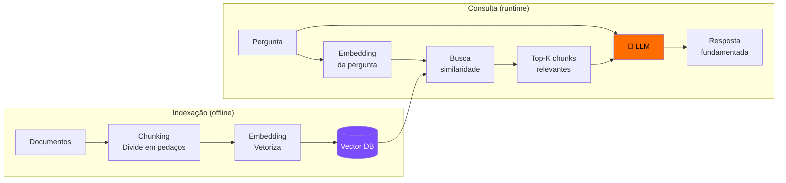
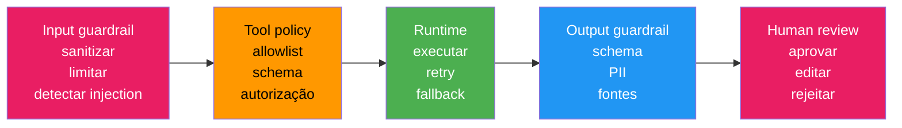
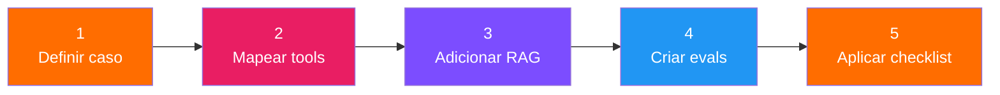

# S05 — Integração de Agentes com Sistemas Reais, RAG e Avaliação

## DIA 1 — Integração de Agentes com Sistemas Reais

### Objetivos

| # | Objetivo |
|---|----------|
| 01 | Transformar APIs em tools confiáveis |
| 02 | Definir contratos e JSON validado |
| 03 | Separar decisão do LLM de invariantes de código |
| 04 | Desenhar a primeira arquitetura do agente |

---

### Trace de Agente — O que Observar

Um trace mostra a conversa entre LLM, tool calls e resultados de API:

```
agent_trace.log

1. user_input
   "Analise o ticket #4821"

2. tool_call
   get_ticket(ticket_id="4821")

3. tool_result
   {"error":"403", "service":"analytics-api", "user_id":"u_77"}

4. tool_call
   check_user_access(user_id="u_77", resource="dashboard")

5. tool_result
   {"allowed": false, "reason": "role sales_manager sem permissão"}

6. final_output
   {"category":"auth", "requires_human": false,
    "recommended_action":"revisar role ou invalidar cache"}
```

!!! warning "Ponto-chave"
    O LLM não "acessa a API". Ele solicita uma tool call. O seu **runtime** valida, executa e devolve o resultado.

---

### Implementar Wrapper da API

A tool é uma **fronteira de engenharia** — não é apenas chamar um endpoint:

```python
from pydantic import BaseModel, Field
import httpx

class AccessInput(BaseModel):
    user_id: str = Field(min_length=1)
    resource: str = Field(min_length=1)

def check_user_access(user_id: str, resource: str) -> dict:
    args = AccessInput(user_id=user_id, resource=resource)
    try:
        response = httpx.get(
            f"https://internal-api/access/{args.user_id}",
            params={"resource": args.resource},
            timeout=3.0,
        )
        response.raise_for_status()
        return normalize_access_payload(response.json())
    except httpx.TimeoutException:
        return {"status": "error", "reason": "timeout"}
```

**O que o wrapper resolve:**

- ✅ Validação de argumentos (Pydantic)
- ✅ Timeout e erro HTTP
- ✅ Normalização do payload
- ✅ Retorno simples para o LLM

---

### Código vs Prompt — Onde Resolver Cada Problema

| Problema | Código / policy | Prompt |
|----------|----------------|--------|
| **Campo obrigatório ausente** | Validação bloqueia execução | Não resolve sozinho |
| **Formato JSON inválido** | Schema + retry controlado | Ajuda, mas não garante |
| **Tom da resposta** | Pouco relevante | Define clareza e postura |
| **Classificação ambígua** | Regras mínimas e fallback | Ajuda a decidir por critérios |
| **Permissão de ação crítica** | Sempre código/policy/HITL | Nunca como única barreira |
| **Resposta sem fonte** | RAG, eval e policy | Pode reforçar, mas não basta |

!!! danger "Regra fundamental"
    Nunca confie apenas no prompt para controlar ações críticas. Validações determinísticas (código) devem ser a barreira principal.

---

### Framework D.E.C.I.D.E.

Aplicado ao projeto SupportOps:

| Letra | Aplicação no projeto |
|-------|---------------------|
| **D** | Classificar ticket 403 e sugerir ação com evidência |
| **E** | Ticket, usuário, role, serviço, incidentes e runbook |
| **C** | check_user_access, get_service_status, search_runbook |
| **I** | Sem alteração de role; aprovação humana para escrita sensível |
| **D** | JSON com category, priority, evidence e requires_human |
| **E** | Dataset com tickets normais, ambíguos e adversariais |

---

### Chain-of-Thought em 2026

| Como ensinar | Como NÃO usar |
|-------------|---------------|
| CoT explícito é importante historicamente. Modelos modernos podem raciocinar internamente. Em produção, peça **plano, critérios e validação**. | Evite "mostre todo seu raciocínio" como padrão. Não confunda explicação com garantia. Não exponha raciocínio sensível. |

!!! tip "Mensagem"
    Prefira planos verificáveis, checagens e saída estruturada.

---

### Tipos Práticos de Memória

| Tipo prático | Onde vive | Exemplo no SupportOps | Quando usar |
|-------------|-----------|----------------------|-------------|
| **Estado da sessão** | messages[] / state | ticket atual, tool results, plano atual | Durante uma execução |
| **Memória operacional** | SQL/NoSQL/logs | decisões anteriores, status de workflow | Auditoria e continuidade |
| **Memória semântica** | Vector DB / índice | runbooks, FAQs, docs técnicos, tickets resolvidos | Busca por significado |

!!! info "Noção básica"
    Para produção, pense em: **estado atual**, **memória persistente** e **conhecimento recuperável**.

---

### LangChain, Templates e Guardrails

| Item | O que é | Por que mostrar |
|------|---------|----------------|
| **LangChain** | Framework/biblioteca | Organiza tools, prompts e integração |
| **Prompt templates** | Abstração de prompt | Evita prompt hardcoded espalhado no código |
| **Guardrails** | Camada de controle | Valida input, output e ação |
| **LangGraph** | Orquestrador | Estado, nós, arestas e HITL |
| **Pydantic/Zod** | Validação determinística | Schema, tipos e integração segura |

---

## RAG — Retrieval-Augmented Generation

RAG resolve o problema de LLMs não conhecerem **seus dados específicos**.



### Por que RAG?

| Abordagem | Prós | Contras |
|-----------|------|---------|
| **Fine-tuning** | Conhecimento "embutido" | Caro, desatualiza rápido |
| **Prompt longo** | Simples | Limitado pela janela |
| **RAG** | Atualizado, escalável, rastreável | Mais complexo de implementar |

### Top-k e Reranking

| Etapa | Entrada | Saída | Trade-off |
|-------|---------|-------|-----------|
| **Top-k** | query embedding | 20 candidatos rápidos | barato e amplo |
| **Reranking** | query + candidatos | 5 melhores reordenados | mais caro, mais preciso |
| **Prompt final** | top chunks reordenados | contexto enxuto | menos ruído |

=== "Top-k"
    Busca rápida no vector store. Retorna os K chunks mais próximos da query por similaridade vetorial.

=== "Reranking"
    Reavalia os candidatos com um modelo mais caro/preciso, olhando query + documento juntos.

### Componentes do RAG

=== "1. Chunking"
    | Estratégia | Quando usar |
    |-----------|-------------|
    | Tamanho fixo (500 tokens) | Textos genéricos |
    | Por parágrafo/seção | Documentação estruturada |
    | Semântico | Quando precisão é crítica |
    
    !!! warning "Chunk muito grande = ruído. Muito pequeno = perde contexto."

=== "2. Embeddings"
    ```python
    from openai import OpenAI
    
    response = client.embeddings.create(
        model="text-embedding-3-small",
        input="Como funciona autenticação JWT?"
    )
    vector = response.data[0].embedding  # [0.023, -0.041, ...]
    ```

=== "3. Vector DB"
    | DB | Tipo | Melhor para |
    |---|---|---|
    | Chroma | In-memory/local | Protótipos |
    | Pinecone | Cloud managed | Produção |
    | pgvector | PostgreSQL extension | Já usa Postgres |
    | Qdrant | Self-hosted | Controle total |

=== "4. Retrieval"
    ```python
    results = vector_db.similarity_search(
        query="Como resetar senha?",
        k=5  # top 5 mais relevantes
    )
    ```

---

## Guardrails — Segurança em Camadas

### Recap: O Novo Problema

| Até agora | Novo risco |
|-----------|-----------|
| Consulta APIs | Alterar permissão errada |
| Usa memória | Fechar ticket errado |
| Usa RAG | Vazar dados sensíveis |
| Sugere soluções | Entrar em loop caro |

!!! danger "Pergunta central"
    Até onde o agente pode ir sozinho?

### Arquitetura de 5 Camadas



Cada camada bloqueia uma classe de erro diferente. Não é redundante com o workflow de integração: aqui o foco é **segurança e controle**.

---

## Métricas para Agentes com Tools

| Métrica | O que mede | Exemplo no SupportOps |
|---------|-----------|----------------------|
| **Tool selection accuracy** | A tool certa foi escolhida? | search_runbook vs get_user |
| **Argument validity** | Argumentos seguem schema? | service_id válido |
| **Step success rate** | Etapas concluídas sem erro? | 3/4 tools executadas |
| **Escalation precision** | Pediu humano quando devia? | ação sensível |
| **Retry/error handling** | Tratou falhas de API? | timeout não derruba fluxo |

---

## Avaliação de LLMs e Agentes

### Por que Avaliar LLMs é Diferente

Em software tradicional, um teste pergunta: passou ou falhou? Em LLMs, isso quase nunca é suficiente.

| Desafio | Explicação |
|---------|-----------|
| **Não existe resposta única** | A mesma pergunta pode ter várias respostas válidas, com níveis diferentes de clareza, completude e utilidade |
| **A falha pode ser semântica** | A resposta pode estar gramaticalmente boa e ainda assim não responder à pergunta ou usar evidência errada |
| **O pipeline também falha** | Em RAG, o erro pode estar na busca, no reranking, no prompt, no modelo ou na composição do contexto |

!!! quote "LLMs não falham só por erro: falham por qualidade, relevância e confiança."

### Framework de Avaliação

| Dimensão | Pergunta | Como medir |
|----------|----------|------------|
| **Faithfulness** | A resposta é fiel aos documentos? | LLM-as-judge |
| **Relevance** | Responde a pergunta do usuário? | LLM-as-judge + humano |
| **Groundedness** | Cada afirmação tem fonte? | Verificar citações |
| **Hallucination** | Inventou informação? | Comparar com docs |
| **Completeness** | Cobriu todos os pontos? | Checklist |

### LLM-as-Judge

```python
evaluation_prompt = """
Avalie a resposta abaixo em uma escala de 1-5:

Pergunta: {question}
Contexto fornecido: {context}
Resposta gerada: {answer}

Critérios:
- Fidelidade ao contexto (não inventou?)
- Relevância (respondeu a pergunta?)
- Completude (cobriu os pontos importantes?)

Score (1-5) e justificativa:
"""
```

---

## Checklist P.R.O.D.U.C.T.I.O.N.

| Letra | Área | Detalhes |
|-------|------|----------|
| **P** | Policies | Regras de ação e permissões |
| **R** | Retrieval | Fontes, filtros e citations |
| **O** | Observability | Traces, custo e latência |
| **D** | Data boundaries | PII, tenants e escopo |
| **U** | User approval | HITL para ações sensíveis |

!!! success "Primeira metade"
    Políticas, conhecimento, rastreabilidade, fronteiras de dados e aprovação humana.

---

## Dataset Mínimo de Avaliação

Crie 20 perguntas para testar seu RAG:

| Tipo | Quantidade | Objetivo |
|------|:---:|----------|
| Fáceis (resposta direta) | 5 | Baseline — deve acertar 100% |
| Multi-documento (resposta espalhada) | 5 | Testa recuperação e síntese |
| Pegadinhas (resposta parcial) | 5 | Testa se não inventa o resto |
| Sem resposta na base | 5 | Testa se sabe dizer "não sei" |

!!! tip "Um bom RAG precisa saber responder E saber dizer 'não encontrei evidência'."

---

## Próximos Passos do Projeto



!!! quote "Mensagem final"
    Agente em produção não é prompt grande. É **arquitetura**: contrato, memória, recuperação, segurança, observabilidade e avaliação.

---

## 🧪 Repositório

Os exercícios desta sessão estão no repositório **SupportOps Agent Lab**:

```bash
git clone https://github.com/LAB365/supportops-agent-lab.git labs/supportops
cd labs/supportops
python run.py doctor
```

[:octicons-arrow-right-24: Ver instruções completas no Repositório](../repositorio.md){ .md-button }
