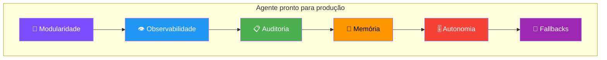
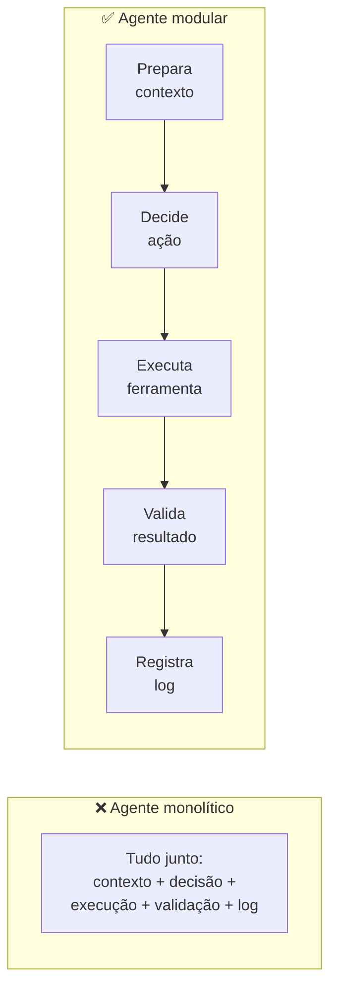
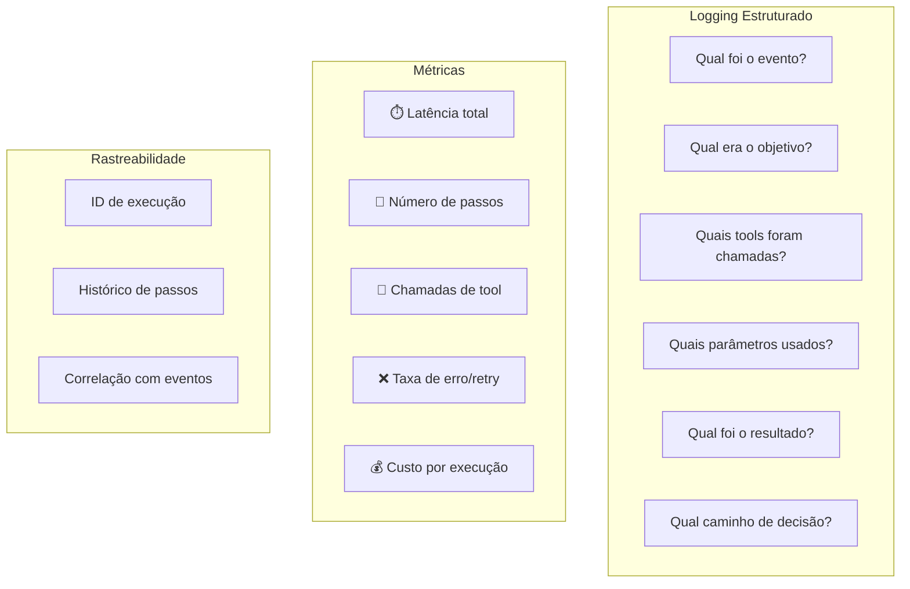
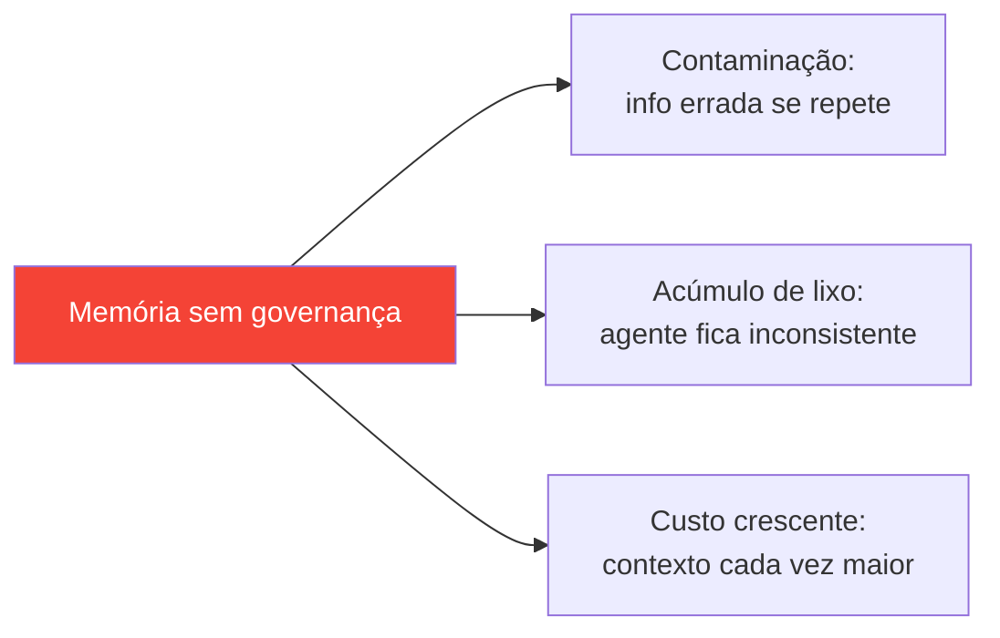
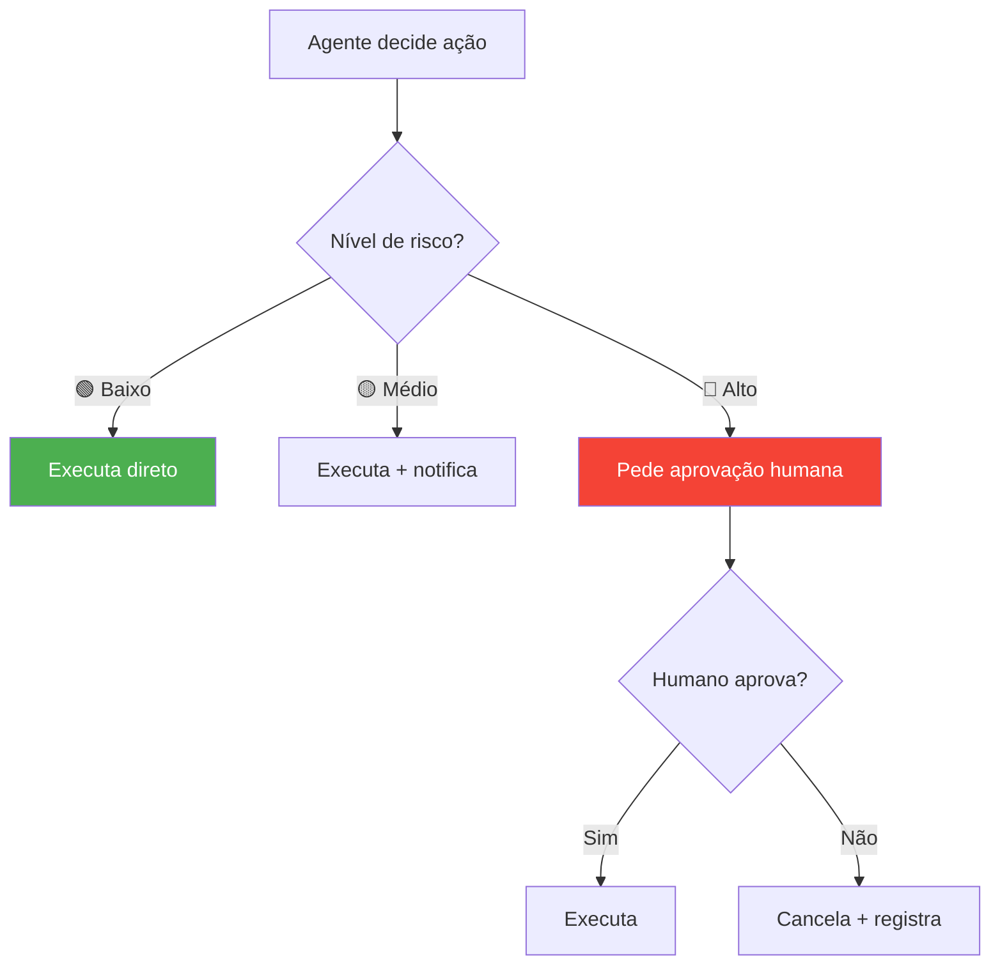

# S06 — Agentes em Produção

## Do Protótipo ao Sistema Real

Um agente que funciona em demo não é um agente pronto para produção. A diferença está em **6 pilares**:



!!! quote "Princípio"
    O agente está reduzindo trabalho repetitivo e aumentando consistência, ou está criando mais barulho e mais coisa para o time revisar?

---

## 🧩 Modularidade

Um agente **não pode tentar fazer tudo sozinho**. Misturar raciocínio, execução, validação e integração em um bloco só cria fragilidade.



### Benefícios

- Se a **ferramenta muda** → ajusta só a camada de execução
- Se o **modelo muda** → ajusta só a camada de decisão
- Se o **formato de output muda** → ajusta só a validação
- Cada módulo é **testável isoladamente**

!!! tip "Regra prática"
    Se você não consegue explicar a arquitetura do agente em um diagrama simples, ele já está complexo demais.

---

## 👁️ Observabilidade

Sem observabilidade, o agente é uma **caixa-preta**. Quando algo dá errado, ninguém sabe por quê → o time para de usar.

### O que registrar



### Ferramentas do curso

| Ferramenta | Função | Lab |
|-----------|--------|-----|
| **Langfuse** | Traces de LLM, custo, latência | Lab 2 |
| **MLflow** | Experimentos, comparação de modelos | Lab 2 |
| **DeepEval** | Avaliação de qualidade (faithfulness, relevancy) | Lab 4 |
| **Logs estruturados** | Rastreio passo a passo | Lab 3 |

!!! danger "Sem logs e métricas, o agente não é confiável — mesmo que funcione."

---

## 📋 Auditoria

Quando agentes executam ações em sistemas reais, a pergunta é: **quem acionou, o que foi executado e por quê?**

### O que registrar

| Campo | Exemplo |
|-------|---------|
| **Evento de entrada** | "Usuário perguntou sobre ticket TCK-4821" |
| **Decisões do agente** | "Classificou como intent=ticket, extraiu id" |
| **Ações executadas** | "Chamou fetch_ticket_context({ticket_id: TCK-4821})" |
| **Resultado** | "Retornou severity=high, service=auth" |
| **Timestamp + ID** | "exec_id=abc123, 2026-05-15T10:30:00Z" |

!!! info "Princípio fundamental"
    Se o agente pode executar uma ação, essa ação **deve deixar rastro**. Qualquer operação que muda estado precisa ser rastreável.

---

## 🧠 Memória em Produção

### Dois tipos

| Tipo | O que é | Onde persiste |
|------|---------|--------------|
| **Curto prazo** | Contexto imediato (evento atual, dados recuperados, histórico recente) | Janela de contexto / state |
| **Longo prazo** | Conhecimento reutilizável (decisões anteriores, padrões, preferências) | Banco, vector DB, arquivos |

### Riscos



### Boas práticas

- ✅ Critérios claros do que gravar (não gravar tudo)
- ✅ Expiração ou versionamento
- ✅ Mecanismo de limpeza
- ✅ Estado estruturado (não depender só da janela de contexto)

!!! warning "Memória mal gerenciada transforma o agente em um sistema que **piora com o tempo**."

---

## 🎚️ Autonomia por Nível de Risco

A autonomia do agente deve ser **proporcional ao risco** da ação:

| Nível | Ações | Controle |
|-------|-------|----------|
| 🟢 **Baixo** | Gerar relatório, resumir, comentar em PR | Automático |
| 🟡 **Médio** | Abrir ticket, atualizar status, enviar mensagem | Log + notificação |
| 🔴 **Alto** | Alterar permissões, aplicar desconto, deletar dados | **Human-in-the-loop obrigatório** |



!!! example "Exemplo do Lab 4 (SupportOps)"
    ```python
    FORBIDDEN_ACTIONS = {"change_user_role", "grant_permission", "close_ticket"}
    ALLOWED_TOOLS = {"get_ticket_context", "check_user_access", "search_runbook"}
    ```
    O agente **nunca** executa ações de alto risco — apenas recomenda e espera aprovação.

---

## 🛟 Lidando com Falhas

Agentes falham. A questão é: **falham de forma controlada ou catastrófica?**

### Estratégias

| Falha | Estratégia |
|-------|-----------|
| LLM não responde | Retry com backoff exponencial |
| Tool retorna erro | Fallback para resposta parcial |
| Classificação ambígua | Rota para fallback/humano |
| Custo excede threshold | Interrompe execução |
| Loop detectado | MAX_ITERATIONS + alerta |

### Padrão de fallback

```python
def run_with_fallback(state, llm, mcp_client):
    try:
        result = run_agent_flow(state, llm, mcp_client)
        if not result.get("final_answer"):
            return fallback_response(state, "Agente não gerou resposta")
        return result
    except TimeoutError:
        return fallback_response(state, "Timeout na execução")
    except Exception as e:
        log_error(state, e)
        return fallback_response(state, f"Erro inesperado: {type(e).__name__}")
```

!!! tip "Regra de ouro"
    O agente deve **sempre** retornar algo útil ao usuário, mesmo quando falha internamente.

---

## Checklist: Agente Pronto para Produção

- [ ] **Modular** — responsabilidades separadas, testáveis isoladamente
- [ ] **Observável** — logs estruturados + métricas + traces
- [ ] **Auditável** — toda ação deixa rastro (quem, o quê, por quê)
- [ ] **Memória governada** — critérios de gravação, expiração, limpeza
- [ ] **Autonomia controlada** — níveis de risco + human-in-the-loop
- [ ] **Resiliente** — fallbacks, retry, degradação graceful
- [ ] **Custo previsível** — limite de tokens/iterações por execução
- [ ] **Testável** — FakeLLM para testes determinísticos (Lab 3)
- [ ] **Versionado** — prompts e tools versionados como código

---

## Onde Praticar

| Conceito | Lab | Exercício |
|----------|-----|-----------|
| Modularidade (nodes separados) | Lab 3 | Ex07-16 (LangGraph) |
| Observabilidade (Langfuse) | Lab 2 | semana3_monitoramento |
| Auditoria (logs de decisão) | Lab 3 | Ex16 (fluxo completo) |
| Guardrails (allowlist, injection) | Lab 4 | guardrail_tools.py |
| Autonomia (forbidden actions) | Lab 4 | Ex02 (tool design) |
| Fallbacks | Lab 3 | fallback_node |
| Avaliação (DeepEval) | Lab 4 | dia3 |
| Métricas (MLflow) | Lab 2 | ml_flow_example.py |
