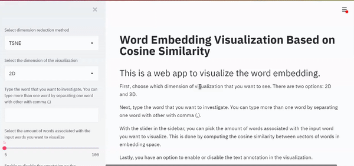
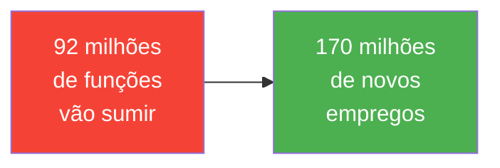
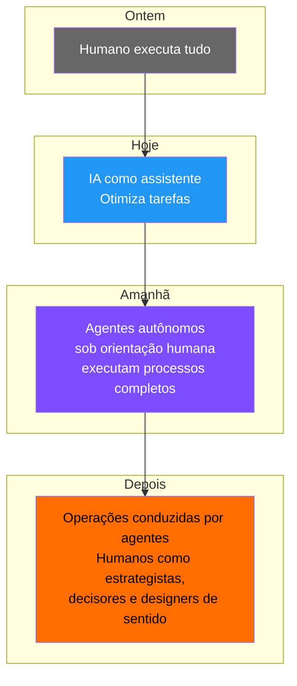

# 🤖 AI4Devs — IA para Desenvolvedores

> **"A IA não representa o fim do nosso trabalho. Mas o fim do trabalho sem alma."**
> — Andrea Dietrich

  
  

    Visualização 3D de word embeddings — palavras com significado similar se agrupam.
    <a href="https://projector.tensorflow.org/" target="_blank">Explore ao vivo →</a>
  

---

## 🌍 Por que IA Agora?

<small>Fonte: World Economic Forum, 2025</small>

| Dado | Fonte |
|------|-------|
| **39%** das habilidades exigidas hoje serão transformadas até 2030 | WEF 2025 |
| Vida útil de uma skill em tech: **2,5 anos** | Harvard Business Review |
| Apenas **21%** dos funcionários se sentem engajados no trabalho | Gallup |
| **80%** da força de trabalho relata falta de tempo/energia | Microsoft |

!!! danger "A janela está fechando"
    Não se trata mais de acumular conhecimento, mas de **adquirir novas habilidades em curtos períodos** e aplicá-las imediatamente. — *Ian Beacraft*

---

## A Evolução do Papel Humano

| Antes | Agora |
|-------|-------|
| Times orientados por **funções** | Times orientados por **objetivos** |
| Estrutura **rígida** | Estrutura **flexível** |
| Expertises **fixas** | Expertises **sob demanda** |
| Burocracia | Agilidade — fortalecida por agentes |

!!! tip "Cada pessoa se torna chefe de um time de agentes"
    O dev deixa de ser executor e vira **orquestrador**: define objetivos, impõe limites, valida resultados.

---

## As Inteligências que a IA NÃO Substitui

| Inteligência | O que é | Por que importa |
|-------------|---------|-----------------|
| 🧠 **Estratégica** | Pensar em sistemas, antecipar consequências | IA executa, humano decide *o quê* e *por quê* |
| 🤝 **Social** | Conexões reais, empatia, colaboração | IA gera texto, humano constrói confiança |
| 🎨 **Criativa** | Conexões inesperadas, intuição | IA combina padrões, humano rompe padrões |
| 🧭 **Espiritual** | Propósito, significado, valores | IA otimiza métricas, humano define *para quê* |

---

## O Curso

!!! success "O que você vai aprender"
    Como usar IA como **ferramenta profissional** — com método, validação e controle — para que você seja o dev que **orquestra** a IA, não o que é substituído por ela.

-   :material-book-open-variant:{ .lg .middle } **Bloco 1 — Fundamentos**

    ---

    Como LLMs funcionam, engenharia de prompt, IA aplicada a código, testes e documentação.

    [:octicons-arrow-right-24: Começar Bloco 1](bloco1/s01-fundamentos.md)

-   :material-robot:{ .lg .middle } **Bloco 2 — Agentes e Automação**

    ---

    Tools, ReAct, memória, orquestração de agentes, MCP, RAG e avaliação.

    [:octicons-arrow-right-24: Começar Bloco 2](bloco2/s01-tools-react.md)

-   :material-flask:{ .lg .middle } **Labs Práticos**

    ---

    5 laboratórios progressivos com código real: do prompt engineering ao agente multi-tool com RAG.

    [:octicons-arrow-right-24: Ver Labs](labs.md)

-   :material-clipboard-check:{ .lg .middle } **Quizzes**

    ---

    Teste seus conhecimentos com feedback imediato após cada sessão.

    [:octicons-arrow-right-24: Ver Quizzes](bloco1/quiz-b1s02.md)

## Estrutura

| Bloco | Sessão | Tema |
|-------|--------|------|
| 1 | S01 | Fundamentos de IA Generativa |
| 1 | S02 | Prompt Engineering |
| 1 | S03 | IA no Desenvolvimento (código, testes, docs) |
| 2 | S01 | Tools, Guardrails e Padrão ReAct |
| 2 | S02 | Memória, Agentes e Orquestração |
| 2 | S03 | Low Code, Flowise, N8N |
| 2 | S04 | MCP, LangGraph, Tools |
| 2 | S05 | RAG e Avaliação de LLMs |
| 2 | S06 | Agentes em Produção |

## Como usar

- 📖 **Leia os resumos** — conteúdo condensado dos ebooks
- 📝 **Faça os quizzes** — teste seu conhecimento com feedback imediato
- 🔍 **Use a busca** — encontre qualquer conceito rapidamente (atalho: `s` ou `/`)

---

*Baseado nos ebooks LAB365 ID — Curso IA para Desenvolvedores*
