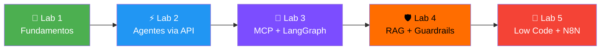
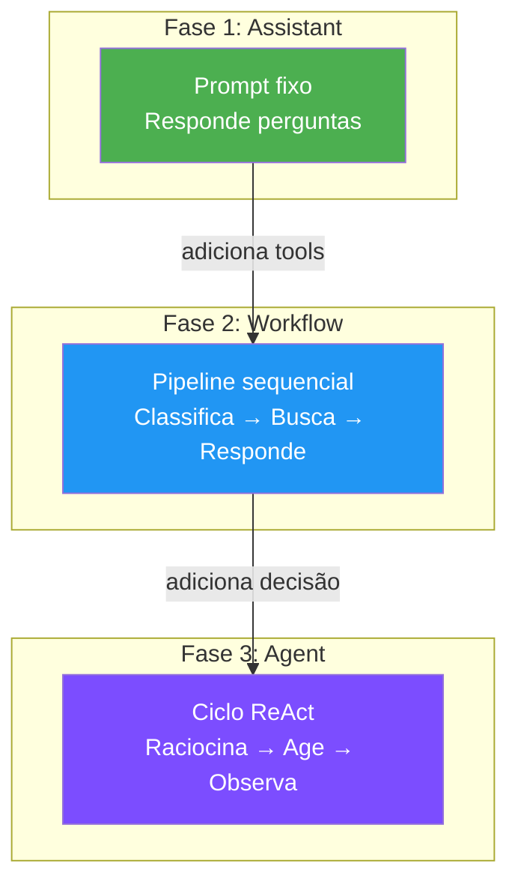
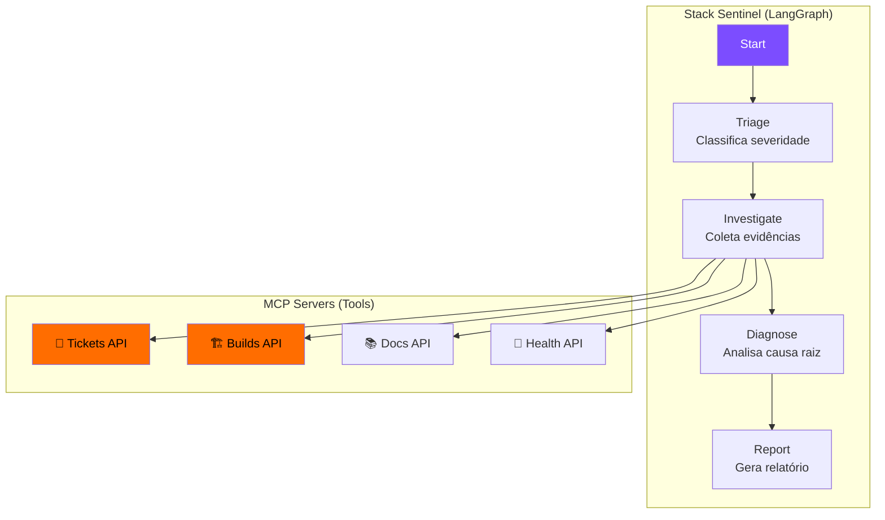
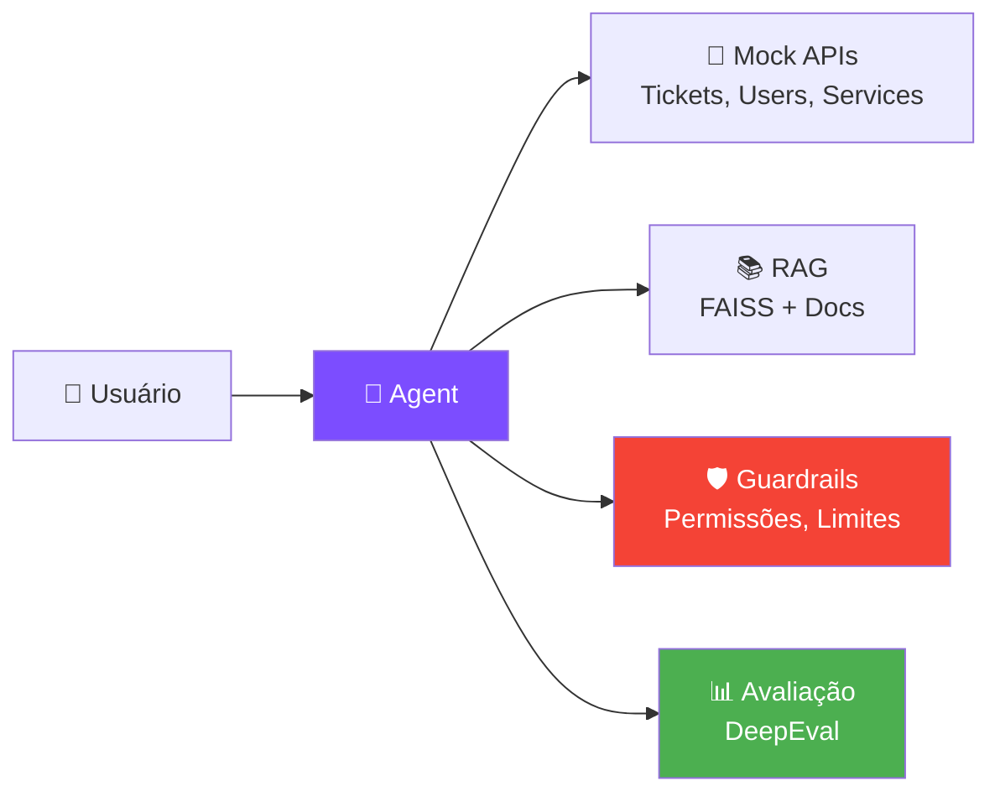

# 🧪 Labs Práticos

## A Missão

Você foi contratado como **Engenheiro de IA** pela **TechOps Inc.**, uma empresa fictícia que precisa modernizar seu suporte técnico. Sua missão: construir agentes inteligentes que automatizem o atendimento, desde um chatbot simples até um sistema multi-agente com RAG, guardrails e monitoramento.

Cada lab é uma **fase da missão**, com complexidade crescente:



---

## 🌱 Lab 1 — Fundamentos: Prompt Engineering na Prática

!!! info "Conceitos aplicados"
    Bloco 1: Tokens, temperatura, janela de contexto, padrões de prompting

**Repo:** `kiro_examples/`

### Exercícios

| # | Desafio | Conceito testado |
|---|---------|-----------------|
| 1 | 🎭 **Context Distraction** — A IA ignora instruções quando o contexto distrai | Engenharia de contexto |
| 2 | 🔍 **Lost in the Middle** — Informação no meio do prompt é ignorada | Janela de contexto / Atenção |
| 3 | 💉 **Prompt Injection** — Instruções maliciosas no input | Guardrails de input |
| 4 | 🤔 **Context Confusion** — IA escolhe a tool errada | Descrição de tools |
| 5 | ☠️ **Data Poisoning** — Dados conflitantes geram output errado | Validação de dados |

### Como rodar

```bash
cd kiro_examples/
# Siga as instruções de cada exercício no readme.md
# Use qualquer IDE com IA (Cursor, Kiro, Claude) para testar
```

!!! tip "Dica lúdica"
    Pense em cada exercício como um **ataque** que você precisa defender. Você é o Red Team testando os limites da IA!

---

## ⚡ Lab 2 — Agentes via API: Do Assistente ao Agente

!!! info "Conceitos aplicados"
    B2S01: Tools, ReAct, Guardrails | B2S02: Memória, Orquestração

**Repo:** `agentes_B2_S01-02/`

### A Evolução



### Exercícios

| # | Desafio | O que constrói |
|---|---------|---------------|
| 1 | 📊 Análise de métricas | Primeiro contato com LLM via API |
| 3 | 🎫 Classificação de tickets | Tool de classificação |
| 6 | 🧠 Memória vetorial | Banco Qdrant + embeddings |
| 8 | 🤖 Agente completo | Loop ReAct com tools |

### Estrutura do projeto

```
agentes_B2_S01-02/
├── exemplos_exercicios/
│   ├── semana1_aula1/        ← Workflows básicos
│   ├── agentes/exe1-8/       ← Exercícios progressivos
│   └── exercicios_rag/       ← RAG com Qdrant
├── pipeline_agentes/
│   ├── agente_01_analista    ← Agente que analisa tickets
│   ├── agente_02_requisitos  ← Agente que extrai requisitos
│   ├── agente_03_auditoria   ← Agente que audita código
│   ├── orchestrator/         ← Orquestrador multi-agente
│   └── memory/               ← Sistema de memória
└── docker-compose.yml        ← PostgreSQL + Qdrant + Langfuse
```

### Como rodar

```bash
cd agentes_B2_S01-02/
docker compose up -d          # Sobe infra (Postgres, Qdrant, Langfuse)
pip install -r requirements.txt
python load_data.py           # Carrega dados de exemplo
```

!!! tip "Dica lúdica"
    Imagine que cada agente é um **funcionário** da TechOps. O Analista lê tickets, o Requisitos extrai o que precisa ser feito, e o Auditor verifica se o código está ok. O Orquestrador é o **gerente** que coordena todos!

---

## 🔧 Lab 3 — MCP + LangGraph: Stack Sentinel

!!! info "Conceitos aplicados"
    B2S04: MCP, LangGraph, Tools, State, Conditional Edges

**Repo:** `stack-sentinel-lab/`

### O Cenário

Você constrói o **Stack Sentinel** — um agente que investiga incidentes de produção consultando tickets, builds, docs e health checks via MCP.



### Exercícios (progressivos)

| Ex | Desafio | Conceito MCP/LangGraph |
|----|---------|----------------------|
| 00 | Setup e doctor | Ambiente |
| 01 | Health check da API | MCP Client básico |
| 02 | Criar primeira tool | Tool com schema tipado |
| 03 | Tool com parâmetros | Input validation |
| 04 | Resource (docs) | MCP Resources |
| 05 | Prompt template | MCP Prompts |
| 06 | State do grafo | LangGraph State |
| 07 | Primeiro node | LangGraph Node |
| 08 | Conditional edge | Roteamento condicional |
| 09-16 | Agente completo | Integração total |

### Como rodar

```bash
cd stack-sentinel-lab/
python run.py doctor    # Verifica ambiente
python run.py setup     # Instala dependências
python run.py mock-api  # Sobe API mockada
python run.py test ex01 # Testa exercício 1
```

!!! tip "Dica lúdica"
    Você é o **detetive de incidentes**! Cada exercício adiciona uma nova "habilidade investigativa" ao seu agente. No final, ele consegue fazer sozinho o que um engenheiro de plantão faz em 30 minutos.

---

## 🛡️ Lab 4 — RAG + Guardrails: SupportOps Agent

!!! info "Conceitos aplicados"
    B2S05: RAG, Avaliação, Faithfulness | B2S01: Guardrails

**Repo:** `supportops-agent-lab/`

### O Cenário

O **SupportOps Agent** é um agente de suporte que:

- Consulta tickets e APIs internas
- Busca documentação via RAG (FAISS)
- Aplica guardrails de segurança
- É avaliado com DeepEval



### Exercícios por dia

=== "Dia 1 — Integração"
    | Ex | Desafio |
    |----|---------|
    | 01 | Explorar Mock API |
    | 02 | Tool design (tratar 403) |
    | 03 | Schema wrapper |
    | 04 | Prompt como carta de intenção |
    | 05 | Agent loop completo |

=== "Dia 2 — RAG + Guardrails"
    | Ex | Desafio |
    |----|---------|
    | 06 | Arquitetura SupportOps |
    | 07 | Prompt clinic |
    | 08 | CoT + Role prompting |

=== "Dia 3 — Avaliação"
    | Ex | Desafio |
    |----|---------|
    | 09+ | DeepEval: Faithfulness, Relevancy |
    | | Métricas de contexto |
    | | Teste de regressão |

### Como rodar

```bash
cd supportops-agent-lab/
python run.py doctor
python run.py setup
python run.py mock-api   # Terminal 1
python run.py test ex01  # Terminal 2
```

!!! tip "Dica lúdica"
    Pense no guardrail como um **segurança de boate**: ele não decide o que acontece lá dentro, mas impede que entre quem não deve e que saia informação sensível!

---

## 🔀 Lab 5 — Low Code: N8N Templates

!!! info "Conceitos aplicados"
    B2S03: N8N, Flowise, automação visual

**Repo:** `awesome-n8n-templates/`

### Templates disponíveis

| Categoria | Exemplos |
|-----------|----------|
| 🤖 **IA + LLMs** | RAG pipelines, classificação, resumo |
| 📧 **Email** | Triagem automática, respostas |
| 📊 **Dados** | ETL, sincronização, dashboards |
| 💬 **Chat** | Discord bots, Slack integrations |
| 🔄 **DevOps** | CI/CD triggers, alertas |

### Como usar

```bash
cd awesome-n8n-templates/
# Importe os .json no seu N8N local
# docker run -p 5678:5678 n8nio/n8n
```

!!! tip "Dica lúdica"
    N8N é como **LEGO para automações**: cada bloco (node) faz uma coisa, e você conecta para criar fluxos complexos sem escrever código!

---

## 🗺️ Mapa: Teoria → Prática

| Conceito teórico | Onde pratica |
|-----------------|-------------|
| Tokens e janela de contexto | Lab 1 (Lost in the Middle) |
| Prompt Engineering | Lab 1 + Lab 4 (Prompt Clinic) |
| Tools e descrições | Lab 2 (exe3) + Lab 3 (ex02) |
| Padrão ReAct | Lab 2 (exe8) + Lab 3 (ex07+) |
| Guardrails | Lab 1 (Injection) + Lab 4 (dia2) |
| Memória | Lab 2 (exe6 - Qdrant) |
| MCP (Tools/Resources/Prompts) | Lab 3 (ex02-ex05) |
| LangGraph (State/Nodes/Edges) | Lab 3 (ex06-ex16) |
| RAG (Chunking/Embeddings/Retrieval) | Lab 4 (dia2) |
| Avaliação (DeepEval) | Lab 4 (dia3) |
| Orquestração multi-agente | Lab 2 (pipeline_agentes/) |
| Low Code / N8N | Lab 5 |

---


