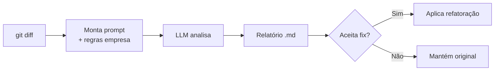

# 👥 Projetos das Equipes

Projetos finais desenvolvidos pelos grupos do curso AI4Devs. Cada equipe aplicou os conceitos aprendidos em um produto real com backend, frontend, Docker e IA integrada.

---

## 🏆 Grupo 6 — Mentoria.IA

> Plataforma de mentoria de carreira com IA. Analisa perfil profissional, identifica gaps de competência e gera planos de desenvolvimento personalizados.

[:octicons-mark-github-16: Repositório](https://github.com/IA-para-DEVs-SD/grupo-6-mentoria){ .md-button }
[:octicons-video-16: Demo](https://youtu.be/V7U0qqbPzmk){ .md-button .md-button--primary }

| Stack | Tecnologia |
|-------|-----------|
| Backend | Python, FastAPI, Google Gemini |
| Frontend | React/Vue |
| Auth | Google OAuth |
| Infra | Docker Compose |

**Conceitos aplicados:** RAG, agentes com LLM, análise de perfil, geração de planos

```bash
cd grupo-6-mentoria
docker compose up -d
```

---

## 🔍 Grupo 5 — KiroSonar

> CLI de Code Review inteligente com auto-fix. Analisa `git diff`, envia para LLM avaliar com regras da empresa e aplica refatoração automaticamente.

[:octicons-mark-github-16: Repositório](https://github.com/IA-para-DEVs-SD/grupo-5-kirosonar){ .md-button }



| Módulo | Função |
|--------|--------|
| `cli.py` | Orquestra o fluxo |
| `git_module.py` | Integração Git (diff, arquivos) |
| `ai_service.py` | Chamada à LLM |
| `prompt_builder.py` | Monta prompt com diff + regras |
| `autofix.py` | Extrai e aplica código refatorado |
| `chunker.py` | Divide arquivos grandes |

**Conceitos aplicados:** Tool calling, prompt engineering, automação DevOps

---

## 📊 Grupo 2 — Semantic Log Explorer

> Observabilidade inteligente com RAG para análise semântica de logs. Chat em linguagem natural para diagnosticar falhas e reduzir MTTR.

[:octicons-mark-github-16: Repositório](https://github.com/IA-para-DEVs-SD/grupo-2-semantic-log-explorer){ .md-button }

| Camada | Tecnologia |
|--------|-----------|
| Backend | Python 3.10+, FastAPI |
| IA | LangChain, ChromaDB |
| LLM | Google Gemini |
| Embeddings | `text-embedding-004` |
| Frontend | VueJS 3 |
| Infra | Docker Compose |

**Conceitos aplicados:** RAG completo (chunking → embeddings → retrieval → generation), vector DB, chat interface

```bash
cd grupo-2-semantic-log-explorer
docker compose up -d
```

---

## 📈 Grupo 1 — Dashboard Produtividade Dev

> Dashboard que analisa produtividade de devs a partir do GitHub (commits, PRs, issues) com insights gerados por IA via RAG.

[:octicons-mark-github-16: Repositório](https://github.com/IA-para-DEVs-SD/grupo-1-dashboard-produtividade-dev){ .md-button }

| Camada | Tecnologia |
|--------|-----------|
| Data Source | GitHub GraphQL API |
| Backend | FastAPI + LangChain |
| Vector DB | ChromaDB |
| Embeddings | HuggingFace (`multilingual-e5-large`) |
| LLM | aisuite (Ollama / OpenAI) |
| Frontend | Streamlit + Plotly |
| DB | SQLite |

**Conceitos aplicados:** RAG, embeddings multilíngue, visualização de dados, integração GitHub API

```bash
cd grupo-1-dashboard-produtividade-dev
docker compose up -d
```

---

## 🤝 Grupo 4 — ConectaTalentos

> Sistema de ranqueamento de currículos com IA. Processa PDFs, anonimiza dados (LGPD) e ranqueia candidatos por adequação à vaga.

[:octicons-mark-github-16: Repositório](https://github.com/IA-para-DEVs-SD/Grupo-4-Conecta-Talentos){ .md-button }

| Tecnologia | Uso |
|-----------|-----|
| PyMuPDF | Extração de texto de PDFs |
| Microsoft Presidio | Anonimização LGPD |
| OpenAI API | Análise e ranqueamento |
| FastAPI | API REST |

**Conceitos aplicados:** Processamento de documentos, anonimização, prompt engineering para classificação

---

## 🎮 Hello Game — PyBlaze

> Jogo de plataforma 2D (estilo Sonic) desenvolvido **100% com assistência de IA**. Exemplo completo de projeto com Kiro specs, Docker, CI/CD e 60 testes.

[:octicons-mark-github-16: Repositório](https://github.com/IA-para-DEVs-SD/hello-game){ .md-button }

| Métrica | Valor |
|---------|-------|
| Código | ~1470 linhas |
| Testes | 60 (100% passing) |
| Cobertura | 69% |
| Módulos | 22 |
| Sprites | 100+ procedurais |

**Conceitos aplicados:** PRD com IA, specs técnicas, TDD assistido, Docker, CI/CD, pre-commit hooks

```bash
cd hello-game
docker-compose build
docker-compose --profile test run pyblaze-test
```

---

## 🔧 Hello Legacy — Refatoração

> Código **propositalmente ruim** para praticar refatoração com IA. Exercício de SOLID, Clean Code e Design Patterns.

[:octicons-mark-github-16: Repositório](https://github.com/IA-para-DEVs-SD/hello_legacy){ .md-button }

| Arquivo | Problemas |
|---------|-----------|
| `calculadora_ruim.py` | Função gigante, sem POO, magic numbers |
| `usuarios_bagunca.py` | Listas paralelas, senhas em texto puro |
| `tarefas_gigante.py` | 100+ linhas, código duplicado |
| `processador_confuso.py` | Lógica confusa, sem tratamento de erro |

**Exercício:** Crie uma branch, refatore aplicando SOLID + Clean Code, e compare antes/depois.

```bash
cd hello_legacy
git checkout -b refactor-calculadora
# Use IA para refatorar → revise → commit
```

---

## 🗺️ Conceitos por Projeto

| Projeto | Prompt Eng. | Tools | RAG | Agentes | Docker | CI/CD |
|---------|:-----------:|:-----:|:---:|:-------:|:------:|:-----:|
| Mentoria.IA | ✅ | ✅ | ✅ | ✅ | ✅ | — |
| KiroSonar | ✅ | ✅ | — | ✅ | — | — |
| Semantic Log | ✅ | — | ✅ | — | ✅ | — |
| Dashboard Dev | ✅ | — | ✅ | — | ✅ | — |
| ConectaTalentos | ✅ | — | — | ✅ | — | — |
| PyBlaze (Game) | ✅ | — | — | — | ✅ | ✅ |
| Hello Legacy | ✅ | — | — | — | — | — |
