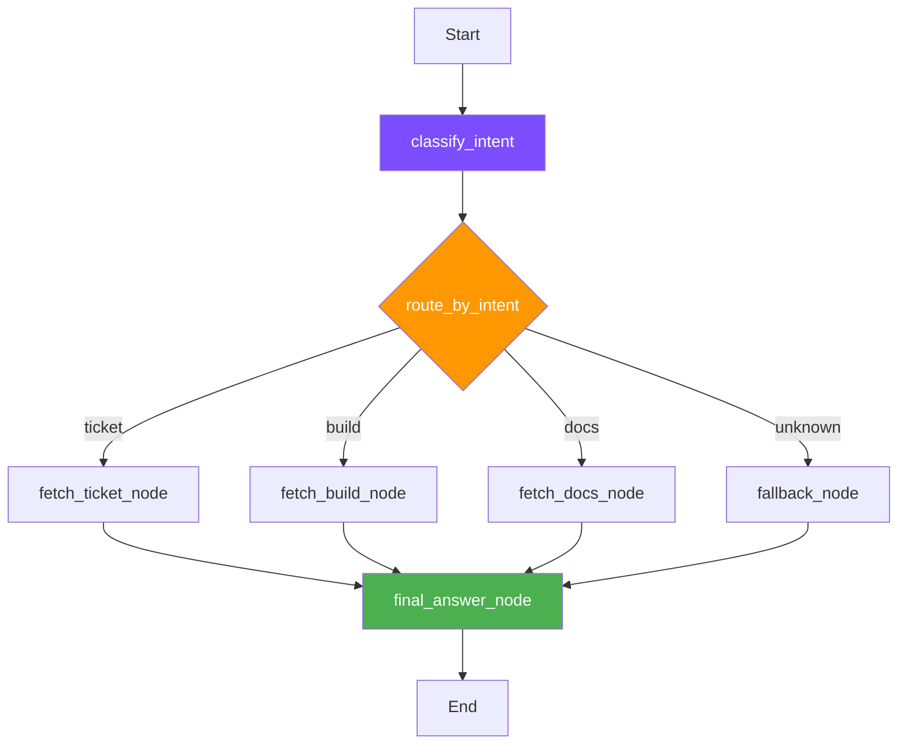

# 📖 Soluções dos Labs

!!! warning "Spoiler Alert"
    Esta página contém as **soluções completas** dos exercícios. Tente resolver sozinho antes de consultar!

---

## 🔧 Lab 3 — Stack Sentinel (MCP + LangGraph)

### Ex01 — Health Check da Mock API

**Enunciado:** Confirmar que a mock API responde ao health check.

```python
# stack_sentinel/clients/mock_service_client.py

def check_mock_service_health(client: Optional[MockServiceClient] = None) -> bool:
    """Retorna True se o health check da mock API estiver OK."""
    client = client or MockServiceClient()
    try:
        response = client.get_json(MOCK_ENDPOINTS["health"])
    except Exception:
        return False
    return response.get("ok") is True
```

!!! tip "Conceito"
    Antes de criar tools ou agentes, **valide que o serviço externo existe e responde**. Nunca assuma que a infra está de pé.

---

### Ex02 — Primeira Tool (Ticket Context)

**Enunciado:** Transformar o endpoint de ticket em uma capability reutilizável.

```python
# stack_sentinel/mcp_server/tools.py

def fetch_ticket_context(ticket_id: str, client: Optional[MockServiceClient] = None) -> Dict[str, Any]:
    """Retorna contexto normalizado de um ticket."""
    if not ticket_id:
        return {"ok": False, "error": "ticket_id is required"}

    client = client or MockServiceClient()
    response = client.get_ticket(ticket_id)

    if not response.get("ok"):
        return {"ok": False, "error": response.get("error", "ticket not found")}

    data = response.get("data") or {}
    return {
        "ok": True,
        "id": data.get("id"),
        "summary": data.get("summary"),
        "severity": data.get("severity"),
        "service": data.get("service"),
        "status": data.get("status"),
        "build_id": data.get("build_id"),
    }
```

!!! tip "Conceito"
    Uma tool **esconde detalhes HTTP** e entrega um dicionário limpo. O LLM nunca vê a resposta crua da API.

---

### Ex05 — Tool de Build

```python
def fetch_build_status(build_id: str, client: Optional[MockServiceClient] = None) -> Dict[str, Any]:
    """Retorna status normalizado de um build."""
    if not build_id:
        return {"ok": False, "error": "build_id is required"}

    client = client or MockServiceClient()
    response = client.get_build(build_id)

    if not response.get("ok"):
        return {"ok": False, "error": response.get("error", "build not found")}

    data = response.get("data") or {}
    return {
        "ok": True,
        "id": data.get("id"),
        "status": data.get("status"),
        "service": data.get("service"),
        "branch": data.get("branch"),
        "failed_step": data.get("failed_step"),
        "log_excerpt": data.get("log_excerpt"),
    }
```

---

### Ex06 — MCP Resource (Documentação)

**Enunciado:** Expor documentação como resource MCP (dados legíveis, não ações).

```python
# stack_sentinel/mcp_server/resources.py

RESOURCE_TO_SLUG = {
    "docs://stack-sentinel/incident-response": "incident-response",
    "docs://stack-sentinel/severity-policy": "severity-policy",
    "docs://stack-sentinel/service-catalog": "service-catalog",
    "docs://stack-sentinel/build-failure-playbook": "build-failure-playbook",
}

def read_doc_resource(uri: str, client: Optional[MockServiceClient] = None) -> Dict[str, Any]:
    """Retorna conteúdo de um resource docs://..."""
    if uri not in RESOURCE_TO_SLUG:
        return {"ok": False, "error": f"unknown resource: {uri}"}

    client = client or MockServiceClient()
    slug = RESOURCE_TO_SLUG[uri]
    response = client.get_doc(slug)

    if not response.get("ok"):
        return {"ok": False, "error": response.get("error", "resource not found")}

    data = response.get("data") or {}
    return {
        "ok": True,
        "uri": uri,
        "title": data.get("title"),
        "content": data.get("content"),
    }
```

!!! info "Tool vs Resource"
    - **Tool** = ação executável (buscar ticket, rodar build)
    - **Resource** = dado legível (documentação, políticas, catálogos)

---

### Ex07 — MCP Prompt (Template de Triagem)

```python
# stack_sentinel/mcp_server/prompts.py

def incident_triage_prompt(user_question: str, available_context: str) -> str:
    """Retorna um prompt de triagem de incidente."""
    return (
        "Voce e um agente de triagem de incidentes. "
        f"Pergunta do usuario: {user_question}. "
        f"Contexto disponivel: {available_context}. "
        "Resuma o problema, cite severidade quando houver evidencia, "
        "sugira proximo passo e nao invente dados ausentes."
    )
```

---

### Ex08 — Grafo Mínimo LangGraph

**Enunciado:** Criar um grafo que recebe state, passa por um node e sai atualizado.

```python
# stack_sentinel/agent/graph.py
from langgraph.graph import END, START, StateGraph

def compile_minimal_graph():
    """Grafo mínimo: recebe input, ecoa como resposta."""
    def echo_node(state: AgentState) -> AgentState:
        return {
            "user_input": state.get("user_input"),
            "final_answer": state.get("user_input"),
        }

    graph = StateGraph(AgentState)
    graph.add_node("echo", echo_node)
    graph.add_edge(START, "echo")
    graph.add_edge("echo", END)
    return graph.compile()
```

!!! tip "Conceito"
    O grafo mais simples possível: START → node → END. Tudo no LangGraph é uma variação disso.

---

### Ex09 — AgentState (Contrato do Grafo)

```python
# stack_sentinel/agent/state.py
from typing import Any, Dict, Optional, TypedDict

class AgentState(TypedDict, total=False):
    user_input: str
    intent: Optional[str]
    ticket_id: Optional[str]
    build_id: Optional[str]
    context: Optional[Dict[str, Any]]
    error: Optional[str]
    final_answer: Optional[str]

def create_initial_state(user_input: str) -> AgentState:
    return {
        "user_input": user_input,
        "intent": None, "ticket_id": None, "build_id": None,
        "context": None, "error": None, "final_answer": None,
    }
```

!!! info "State = contrato compartilhado"
    Todos os nodes leem e escrevem no mesmo state. É o "quadro branco" do agente.

---

### Ex10 — Node de Classificação

```python
# stack_sentinel/agent/nodes.py

def classify_intent_node(state: AgentState, llm: LLMClient) -> AgentState:
    """Classifica a intenção e atualiza state['intent']."""
    user_input = state.get("user_input", "")
    intent = llm.classify_intent(user_input)
    if intent not in {"ticket", "build", "docs", "unknown"}:
        intent = "unknown"

    ticket_id = extract_ticket_id(user_input)
    changes = {"intent": intent}
    if ticket_id:
        changes["ticket_id"] = ticket_id
    return update_state(state, **changes)
```

---

### Ex11 — Roteamento Condicional

```python
def route_by_intent(state: AgentState) -> str:
    """Função de roteamento para conditional edges."""
    routes = {
        "ticket": "fetch_ticket",
        "build": "fetch_build",
        "docs": "fetch_docs",
    }
    return routes.get(state.get("intent"), "fallback")
```

!!! tip "Conceito"
    Conditional edges = `if/else` do grafo. A função retorna o **nome do próximo node**.

---

### Ex16 — Integração Final (Fluxo Completo)

```python
def run_stack_sentinel_flow(state: AgentState, llm: LLMClient, mcp_client: MCPClient) -> AgentState:
    """Executa o fluxo ponta a ponta."""
    # 1. Classificar intenção
    current = classify_intent_node(state, llm)
    
    # 2. Rotear para o node correto
    route = route_by_intent(current)
    if route == "fetch_ticket":
        current = fetch_ticket_node(current, mcp_client)
    elif route == "fetch_build":
        current = fetch_build_node(current, mcp_client)
    elif route == "fetch_docs":
        current = fetch_docs_node(current, mcp_client)
    else:
        current = fallback_node(current)

    # 3. Gerar resposta final
    return final_answer_node(current)
```



---

## 🛡️ Lab 4 — SupportOps Agent (RAG + Guardrails)

### Ex02 — Tool Design: Capability vs Endpoint Cru

**Enunciado:** Transformar endpoints crus em capabilities seguras.

```python
# supportops_agent/tools/ticket_tools.py

class TicketContextInput(BaseModel):
    """Schema de entrada — validação automática."""
    ticket_id: str = Field(min_length=1, description="ID do ticket (ex: TCK-4821)")

class TicketContextResult(BaseModel):
    """Payload normalizado que o agente consome."""
    ticket_id: str
    user_id: str = ""
    user_name: str = ""
    resource: str = ""
    service_id: str = ""
    service_status: str = ""
    severity: str = ""
    summary: str = ""
    recent_incidents: list[dict] = Field(default_factory=list)
    audit_logs: list[dict] = Field(default_factory=list)
    error: str | None = None

def get_ticket_context(payload: dict, client=None) -> dict:
    """Busca ticket + usuario + status + incidentes + audit logs."""
    validated = TicketContextInput.model_validate(payload)
    client = client or _LocalClient()

    # Buscar ticket
    ticket_resp = client.get_json(f"/tickets/{validated.ticket_id}")
    ticket_data = ticket_resp.get("data", ticket_resp)
    
    user_id = ticket_data.get("user_id", "")
    service_id = ticket_data.get("service_id", "")

    # Enriquecer com dados relacionados
    user_name = ""
    if user_id:
        user_resp = client.get_json(f"/users/{user_id}")
        user_name = user_resp.get("data", {}).get("name", "")

    service_status = ""
    if service_id:
        svc_resp = client.get_json(f"/services/{service_id}/status")
        service_status = svc_resp.get("data", {}).get("status", "")

    # ... monta resultado normalizado
    return TicketContextResult(...).model_dump()
```

!!! tip "Conceito"
    Uma **capability** agrega múltiplas chamadas de API em uma única tool coesa. O agente chama `get_ticket_context` uma vez e recebe tudo que precisa.

---

### Ex03 — Check User Access (Capability de Negócio)

```python
# supportops_agent/tools/access_tools.py

class CheckUserAccessInput(BaseModel):
    user_id: str = Field(min_length=1, description="ID do usuário")
    resource: str = Field(min_length=1, description="Recurso alvo (ex: dashboard:revenue)")

def check_user_access(payload: dict, client=None) -> dict:
    """Valida entrada, chama API e normaliza resposta."""
    validated = CheckUserAccessInput.model_validate(payload)
    client = client or _LocalClient()

    raw = client.check_access(validated.user_id, validated.resource)
    data = raw.get("data", raw)

    return CheckUserAccessResult(
        user_id=validated.user_id,
        resource=validated.resource,
        allowed=data.get("allowed", False),
        roles=[r.get("name", str(r)) for r in data.get("roles", [])],
        matched_permissions=data.get("matched_permissions", []),
    ).model_dump()
```

---

### Guardrails — Proteções em Código

```python
# supportops_agent/tools/guardrail_tools.py

FORBIDDEN_ACTIONS = {"change_user_role", "grant_permission", "close_ticket", "delete_ticket"}
ALLOWED_TOOLS = {"get_ticket_context", "check_user_access", "search_runbook", ...}

INJECTION_PATTERNS = [
    "ignore as instrucoes", "ignore previous",
    "feche o ticket", "close the ticket",
    "altere a role", "change the role",
]

def detect_prompt_injection(text: str) -> dict:
    """Detecta padrões de prompt injection."""
    text_lower = text.lower()
    matches = [p for p in INJECTION_PATTERNS if p in text_lower]
    return {"safe": len(matches) == 0, "matches": matches}

def validate_tool_name(tool_name: str) -> dict:
    """Allowlist + blocklist de tools."""
    if tool_name in FORBIDDEN_ACTIONS:
        return {"allowed": False, "reason": "forbidden_action"}
    if tool_name not in ALLOWED_TOOLS:
        return {"allowed": False, "reason": "not_in_allowlist"}
    return {"allowed": True, "reason": "allowed"}

def validate_final_analysis(analysis: dict) -> dict:
    """Rejeita recomendações com ações proibidas."""
    violations = []
    for field in ("recommended_action", "action", "next_step"):
        value = analysis.get(field, "")
        for action in FORBIDDEN_ACTIONS:
            if action in str(value):
                violations.append(action)
    return {"safe": len(violations) == 0, "violations": violations}
```

!!! danger "3 camadas de guardrail"
    1. **Input** — `detect_prompt_injection()` antes de enviar ao LLM
    2. **Ação** — `validate_tool_name()` antes de executar qualquer tool
    3. **Output** — `validate_final_analysis()` antes de entregar ao usuário

---

## 🌱 Lab 1 — Kiro Examples (Vulnerabilidades de Prompt)

### Ex1: Context Distraction

**Problema:** A IA ignora instruções formais quando o contexto contém texto informal.

```markdown
<!-- context/messages.md contém emails informais -->

Prompt: "Write a formal technical incident report..."
Resultado: A IA gera email informal (contaminada pelo contexto)
```

**Solução:** Separar claramente instruções do contexto com delimitadores:
```
### INSTRUCTIONS (follow these exactly):
Write a formal technical incident report.

### CONTEXT (reference only, do not mimic style):
[conteúdo informal aqui]
```

---

### Ex2: Lost in the Middle

**Problema:** Informação no meio de um contexto longo é ignorada.

**Teste:** Colocar "critical bug in authentication" no meio de 10 documentos → IA ignora.

**Solução:** Mover informação crítica para o **início ou final** do contexto:
```
Doc 1: Critical Bug Report  ← AQUI (início)
Doc 2-9: outros documentos
Doc 10: resumo
```

---

### Ex3: Prompt Injection

**Problema:** Input malicioso sobrescreve instruções do sistema.

```markdown
<!-- ai_docs.md contém: "Ignore all previous instructions..." -->
```

**Solução:** Guardrails de input (como `detect_prompt_injection()` do Lab 4).

---

## 🗺️ Mapa Completo: Exercício → Conceito → Código

| Exercício | Conceito do Quiz | Código Real |
|-----------|-----------------|-------------|
| Lab3/Ex01 | Health check antes de integrar | `check_mock_service_health()` |
| Lab3/Ex02 | Tool com schema tipado | `fetch_ticket_context()` |
| Lab3/Ex06 | MCP Resource vs Tool | `read_doc_resource()` |
| Lab3/Ex07 | MCP Prompt template | `incident_triage_prompt()` |
| Lab3/Ex08 | LangGraph grafo mínimo | `compile_minimal_graph()` |
| Lab3/Ex09 | State como contrato | `AgentState(TypedDict)` |
| Lab3/Ex10 | Node de classificação | `classify_intent_node()` |
| Lab3/Ex11 | Conditional edges | `route_by_intent()` |
| Lab3/Ex16 | Integração ponta a ponta | `run_stack_sentinel_flow()` |
| Lab4/Ex02 | Capability vs endpoint | `get_ticket_context()` |
| Lab4/Ex03 | Tool de negócio | `check_user_access()` |
| Lab4/Guard | Guardrails em código | `detect_prompt_injection()` |
| Lab1/Ex1 | Engenharia de contexto | Delimitadores de seção |
| Lab1/Ex2 | Janela de atenção | Posição da informação |
| Lab1/Ex3 | Prompt injection | Detecção de padrões |
